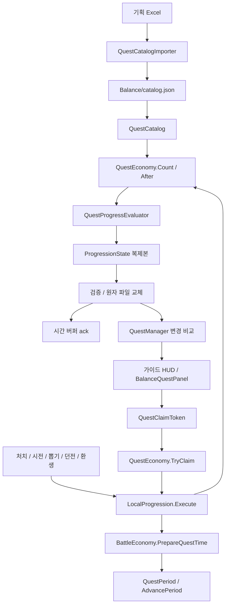

# 퀘스트 통합 구현 기록 — 2026-09-17

## 구현 범위

기존 `QuestManager`와 `QuestEconomy` 진입점을 유지한다. 종류별 매니저나 별도 퀘스트 저장 파일은 추가하지 않았다. 게임플레이는 기존 성공 거래에서 집계하고 UI는 불변 snapshot과 계정·기간 token으로 조회/수령한다. 새 화면이나 프리팹 디자인 변경은 포함하지 않는다.

## 실행 흐름과 코드 책임



- `QuestCatalog`는 JSON 전체를 검증하고 활성 정의·보상·명시적 Next 체인을 인덱싱한다. 비활성 원문은 JSON에 남긴다. 편집 원본은 지정된 Excel이며 런타임은 JSON만 읽는다.
- `QuestProgressEvaluator`는 state와 장비 메타데이터 함수로 값만 계산한다. 파일·UI·싱글턴을 읽지 않는다. 현재 합계와 업적 최고 합계를 구분한다.
- `QuestPeriod`는 명시 UTC 하나로 KST 일일과 월요일 주간을 만든다. 실제 기간 변경은 Economy가 이전 기간 완료를 봉인한 뒤 수행한다.
- `QuestEconomy`는 완료 latch, 해금·선행 수령, 기간별 보관분과 다중 재화 지급을 조율한다. 기존 `Count/Before/After/Claim/Progress` 호출을 유지한다.
- `LocalProgression.Open`은 복원·이관·기간 정리·검증을 마친 상태만 공개한다. `Execute`는 복제본에서 시간 준비→기간→게임 변경→완료 평가→파일 저장→시간 ack→알림 순서로 실행한다.
- `QuestManager`는 bootstrap이 소유하는 기존 DontDestroyOnLoad 컴포넌트다. Start/복귀/계정 변경/기간 경계에서 동기화하고, 조회 캐시와 LateUpdate의 변경 비교로 UI에 알린다. pause와 focus는 별개로 관리한다.
- `QuestContracts`의 board/row/reward는 get-only이며 컬렉션도 복사한다. 새 UI는 `GetSnapshot`, `TryClaim`, `QuestsChanged`만 사용하면 된다. `BalanceQuestPanel`은 기간·업적 정책을 계산하지 않는다.
- `GuideGoalView`와 구형 `GuideQuestUI`도 표시 당시 token을 보관한다. 기존 ID 기반 메서드는 코드 호환용으로 남지만, 화면 버튼은 현재 계정으로 새 token을 만들어 요청하지 않는다.

새 목표를 추가할 때는 우선 Excel의 정의·보상을 편집하고 변환 메뉴를 실행한다. 새로운 목표 **종류**가 필요할 때만 명시 enum 번호를 추가하고 `QuestProgressEvaluator`와 성공 거래의 `Count` 입력을 함께 확장한다. 기간 정책은 `QuestPeriod`, 수령 정책은 `QuestEconomy`, 표시 형식은 UI 바인딩에서 바꾼다. 서버 권한으로 옮길 때에는 지갑까지 함께 승인하는 `LocalProgression.Execute` 경계가 교체 대상이다.

## 향후 UI 연결 예시

화면의 `OnEnable`에서 `QuestsChanged`를 구독하고 최초 snapshot을 바인딩하며, `OnDisable`에서 구독을 해제한다. 아래의 `row`는 표시할 때 받은 불변 값이다.

```csharp
QuestBoardSnapshot board = manager.GetSnapshot(eQuestCategory.Daily);
if (!board.IsReady) return; // 로딩 표시

foreach (QuestRowSnapshot row in board.Rows)
{
    // Title / Description / Progress / RequiredCount / State / Rewards를 화면에 표시한다.
    // 버튼 콜백에는 표시한 row.Token을 보관한다. 클릭할 때 현재 기간으로 다시 만들지 않는다.
    QuestClaimToken displayedToken = row.Token;
    // button.onClick.AddListener(() => Handle(manager.TryClaim(displayedToken)));
}
```

`QuestChangeSet.ChangedTokens`는 달라지거나 제거된 행을 가리킨다. `ChangedCategories`는 다시 조회할 범주이며, 패널은 새 snapshot의 토큰 목록이 달라졌을 때만 행 목록을 재구성한다. `QuestClaimResult.Status`가 `Success`일 때만 성공 연출을 실행한다. 계정 변경·만료·실패 후에도 같은 API로 확정 상태를 다시 바인딩한다.

## 저장과 보상

전체 경제 Schema=1 및 기존 `quest:{id}:{period}`, `L|type|target`, `D날짜|type|target`, `W월요일|type|target` 형식을 유지한다. 퀘스트 하위 스키마를 추가하고 기존 목표 enum 숫자를 명시적으로 고정했다.

`CompletedQuests`는 활성 가이드에서 달성한 항목과 전체 업적 달성을 보존한다. 미래 가이드의 CurrentState는 활성화 시 현재값을 읽는다. 업적은 선행 수령 전에도 달성 기록을 모으되 청구는 체인 순서를 따른다. 일일·주간 카운터는 해금 전에도 수집하며 1-11 최초 클리어 후 같은 기간 기록을 인정한다.

`QuestPending`은 원래 기간 종료+7일의 만료와 당시 보상 규칙·표시 정보를 보존한다. 신규 동적 골드는 성공 수령 시 계산하며, 구버전 pending의 Gold는 고정액으로 이관한다. 지갑·GoldRemainder·Claims·보관분 삭제는 같은 파일 교체로 확정한다. 실패한 저장은 UI 성공으로 발행하지 않는다.

복원은 gameplay 이벤트를 재생하지 않는다. 기존 장비 import는 `recordQuestProgress=false`로 보유 상태만 복구한다. 확인되지 않은 과거 누적이나 옛 SO ID 1~4 대응을 만들어내지 않는다. 서버 동기화와 다중 기기 승인은 이번 구현 범위 밖이다.

## 전투 시간

실제 전투 Task만 단조 시간을 수집하며 배속 배율을 곱하지 않는다. 메뉴·모달·로딩·정지·백그라운드는 제외한다. Tick과 거래 prepare가 같은 샘플 지점을 공유해 다른 Update가 자정을 먼저 넘겨도 옛 기간 시간이 뒤늦게 입력되지 않게 한다.

기간 bucket의 정수 초만 저장하고 동일 기간 소수 잔량은 다음 거래에 합친다. 끝난 기간의 1초 미만 잔량은 확정 후 버린다. 파일 저장 성공 때만 해당 batch를 ack한다. 계정 전환 전 flush 실패 시 전환을 보류한다. 정상 pause에서는 flush를 시도하지만 강제 종료 직전 미확정 버퍼까지 보존하는 WAL은 도입하지 않았다.

## 검증 진입점

- Unity 메뉴: `KingdomIdle > Validation > Quest System`.
- `QuestEditorValidation.Run`: 원본 Excel/JSON 동등성, 규칙·실제 파일 거래·시간·Manager API 검사, bootstrap 및 관련 프리팹의 직렬화 참조 확인.
- 실행 요청: `Library/QuestValidation.request`에 `refresh`를 기록하면 Editor update에서 import 후 고정된 검사만 실행한다. Play Mode에서는 실행하지 않는다.
- 결과: `AI/validation/quests-20260917/editor-validation.json`.
- QA용 검사와 시각·계정 hook은 `UNITY_EDITOR || LOBBY_DEVICE_QA`에 한정한다. 일반 플레이어에는 포함되지 않는다.
- 인수 검사는 EditMode에서 실행한다. 기존 전투 세션을 재생하는 검사가 아니므로 실행 중인 전투에 QA 계정을 바인딩하지 않는다.

## 독립 검토와 반영

| 검토 담당 | 관점 | 결과와 조치 |
|---|---|---|
| 카탈로그·저장 검토 에이전트 | 정의 검증, 이관, 원자 지급, 보관분 | 스키마 1 보관분은 현재 정의 없이 복원 가능. legacy 고정 골드 보존, 수령 재진입 방어 확인 |
| UI·호환성 검토 에이전트 | 기존 HUD, 불변 계약, 이벤트, 조회 비용 | 계정 변경 직후 이전 HUD 클릭을 재현하여 표시 token 방식으로 수정하고 회귀 검사 추가 |
| 게임플레이·시간 검토 에이전트 | 기간 경계, 실패 재시도, 계정 격리, 실제 시간 | 원시 UTC/승인 UTC 혼용 시 5초 소실을 재현. 공통 샘플 경로에서 승인 시각 하한을 적용하여 5초+소수 잔량 보존 |

이 평가는 코드 검토와 명시된 재현 검사의 결과이며 성능 점수나 기기 실행 결과로 대신 해석하지 않는다.

구버전(퀘스트 스키마 0) 보관분은 당시 보상 명세가 없으므로 현재 활성 카탈로그의 동일 ID로만 명시적으로 이관한다. 이후 업데이트에서 그 ID까지 제거했다면 자동 폐기하지 않고 로드를 중단한다. 배포 전 해당 legacy 보상 매핑이 필요하다. 현재 베타에서 생성 가능한 보관 ID는 모두 유지되어 있다.

## 실제 검증 결과

Unity `6000.3.21f1`의 별도 격리 프로젝트에 최종 소스를 실제 프로젝트 참조로 컴파일한 DLL과 필요한 의존성을 복사하여 실행했다. 원본 Assets/Library를 링크하지 않았고, QA 저장은 별도 `DefaultCompany/EngineHarness` 경로를 사용했다. 기존 Unity 프로세스·열린 씬·사용자 저장은 이 검사로 교체하지 않았다.

| 검사 | 결과 |
|---|---:|
| 정의·완료·수령·이관 및 실제 뽑기/장비 API | 73개 통과 |
| 기간·전투 시간·실패 재시도·계정 분리 | 24개 통과 |
| UI 계약·가이드 HUD·계정 token·변경 알림 | 30개 통과 |
| 기존 BalanceAcceptance 기본 경제 회귀 | 93개 통과 |
| 실제 ExcelDataReader 변환기와 JSON 의미 동등성 | 1개 통과 |
| 합계 | **221개 통과** |

증거는 `AI/validation/quests-20260917/unity-engine-validation.json`, 전체 입력 해시는 `unity-engine-source-manifest.json`에 보존했다. 최신 코드의 Runtime/Editor/플레이어 조건 Roslyn 컴파일은 모두 오류 0이며 기존 경고는 각각 11/6/11개다. 이 플레이어 조건 검사는 Android/IL2CPP 빌드가 아니다. 컴파일 로그와 변경 소스 해시도 같은 폴더에 있다.

캐시된 `GetSnapshot` 10,000회는 총 0.0877ms, 측정 스레드 추가 할당 0바이트, 저장 0회였다. 이는 이미 만들어진 snapshot 조회만 측정한 값으로 화면 생성·레이아웃·다음 revision의 snapshot 재생성 비용은 포함하지 않는다. 다른 시스템만 변경된 거래는 퀘스트 알림을 발생시키지 않고, 일일 진행만 바뀌면 가이드 알림은 발생시키지 않는 검사도 통과했다.

변경 전 HEAD 소스로 별도의 Unity baseline을 만들어 동일한 `BalanceAcceptance` 93개를 실행했고 모두 통과했다. 두 환경을 순차 실행하여 40회 내구 저장을 비교했다.

| 측정 | 변경 전 HEAD | 변경 후 |
|---|---:|---:|
| 평균 저장 거래 시간 | 6.3607ms | 6.9754ms |
| 해당 QA 저장 파일 크기 | 1,431B | 1,544B |
| 이 검사 중 승인된 저장 횟수 | 40 | 40 |

이번 단일 비교에서 거래당 +0.6146ms(+9.66%), 파일 +113B였다. 동일 호스트라도 비교에 각 1회씩 사용했고 작은 QA 저장을 사용했으므로 통계적 성능 퇴행이나 실제 기기 비용을 확정하는 수치는 아니다. 데이터 이관·완료 보존·검증이 추가된 비용을 관측한 기준점으로 남긴다. 장기간 누적 원장과 많은 보관분을 가진 계정의 기기 측정은 별도다. 신규 snapshot API에는 대응하는 변경 전 API가 없어 UI 조회의 직접 전후 비교는 하지 않았다. 원본/비교 결과 및 HEAD 소스 해시는 `baseline-validation.json`, `performance-comparison.json`, `baseline-source-manifest.json`에 있다. 직전 구현 측정과 소스 해시는 `-r1` 결과에 보존했다.

격리 하네스에는 복사한 의존성의 Burst `.Runtime` 부재, 기존 UniTask `OnParticleUpdateJobScheduled` 메시지 시그니처 진단 2건, 라이선스 토큰 갱신 경고가 남았다. 221개 검사는 실제로 모두 실행됐지만 이를 원본 프로젝트 전체 로그가 깨끗하다는 의미로 해석하지 않는다.

## 남은 실행 검증과 한계

- 원본 프로젝트의 마지막 자동 import 시각은 01:38:30으로, 그 뒤 추가한 파일의 원본 Editor import/직렬화 참조 검사 완료는 확인하지 못했다. `Assets > Refresh` 후 `KingdomIdle > Validation > Quest System` 메뉴가 원본 bootstrap/가이드 프리팹/UGUI 루트의 참조까지 검사한다. 준비된 요청 파일도 동일한 고정 검사를 실행한다.
- Android `adb devices` 결과가 비어 있어 실제 기기 빌드·터치·백그라운드 복귀·전투 장면 검사는 수행하지 못했다.
- 다단 마탑 시전의 집계는 `CastSkill`의 성공 거래에서 1회이고 `CastSeries` 개별 타격에는 집계가 없음을 코드로 확인했다. 실제 전투·표적·코루틴을 포함한 PlayMode 검사는 미실행이다.
- 기존 BalanceAcceptance의 장비/마탑 singleton이 있을 때만 실행되는 장면 의존 분기는 기본 93개에 포함되지 않는다. 새 입력 검사의 뽑기/보관 장비는 임시 실제 MonoBehaviour와 SO를 이용해 별도로 실행했다.
- 강제 종료로 아직 저장되지 않은 전투 시간 버퍼가 사라지는 한계는 유지한다. 정상 pause flush 및 저장 실패 후 재시도와 구분한다.
- 서버 시간 검증과 여러 기기의 동시 보상 승인은 이번 범위 밖이다.

커밋·push·PR은 수행하지 않았다. 코드 설명과 이해 확인 이후 사용자가 책임 경계·거래 순서·실패 시 상태 보존을 직접 설명할 수 있을 때 학습 인계를 완료한다.
