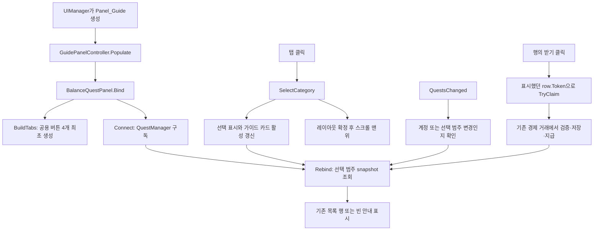

# 퀘스트 4탭 구현 기록 — 2026-09-18

## 구현 결과와 범위

퀘스트창의 기존 `가이드 · 일일 · 주간 · 업적` 문구를 같은 위치의 네 탭으로 바꿨다. 선택한 범주의 퀘스트만 기존 스크롤 목록 하나에 표시한다. 상단 `CurrentQuest` 카드는 가이드 탭에서만 활성화되며 다른 탭에서는 카드의 레이아웃 공간도 접힌다.

기존 `Item_NavTabButton`과 `NavTabButtonView`를 재사용한다. 버튼은 아이콘 없이 텍스트로 표시하고 공용 높이 144를 유지하며 폭은 네 칸에 균등하게 배분한다. 목재 배경·청동 선택 테두리와 공용 클릭 동작을 그대로 사용한다. 별도 퀘스트 매니저, 탭별 스크롤 화면, 새 저장 파일은 추가하지 않았다.

이번 작업은 UI 바인딩 변경이다. 퀘스트 달성·해금·기간·7일 보관·보상 지급 정책은 앞서 구현한 `QuestManager`와 경제 거래 경계를 사용한다. 일괄 수령, 초기화/만료 카운트다운, 가이드 목적지 및 Presentation 연출 확장은 이번 범위에 포함하지 않는다.

## 변경 전과 변경 후

변경 전에도 가이드 외의 일일·주간·업적 데이터와 개별 수령은 존재했다. `BalanceQuestPanel.Rebind`가 네 범주의 snapshot을 차례로 읽어 한 목록으로 합쳤고, 범주 이름은 고정 문구와 각 행에서만 구별했다. 따라서 이번 작업을 일일·주간·업적 도메인의 최초 구현으로 설명하면 안 된다.

| 동작 | 변경 전 | 변경 후 |
|---|---|---|
| 목록 조회 | 네 범주를 모두 읽어 이어 붙임 | `GetSnapshot(SelectedCategory)` 한 범주를 읽음 |
| 분류 입력 | 고정 문구 | 가이드·일일·주간·업적 버튼 |
| 상단 현재 퀘스트 | 패널에 항상 표시 | 가이드 탭에서만 표시 |
| 진행 변경 이벤트 | 어떤 범주가 바뀌어도 목록 재조회 | 계정 또는 현재 탭 범주가 바뀔 때 재조회 |
| 목록이 비었을 때 | 별도 완료 안내 없음 | 준비 중·가이드 완료·해당 기간 수령 완료·업적 수령 완료 안내 |
| 보상 수령 | 표시한 행의 token 사용 | 동일한 token 경로 유지 |
| 스크롤 전환 | 통합 목록 위치 | 탭 변경 시 관성 중지 후 맨 위 |

## 수정 파일과 책임

| 파일 | 책임과 변경 |
|---|---|
| `Assets/UGUI/Scripts/Views/GuidePanelView.cs` | 직렬화된 화면 참조만 보관한다. `tabBar`, `currentQuestRoot`를 추가하고 기존 진행 바·라벨·스크롤 필드는 보존한다. |
| `Assets/UGUI/Scripts/Views/BalanceQuestPanel.cs` | 선택 상태, 탭 생성·입력, 선택 범주 목록, 빈 상태, manager 구독을 담당한다. 진행 판정과 지급을 직접 하지 않는다. |
| `Assets/UGUI/Editor/CompactHudBuilder.cs` | `ApplyQuestTabs`로 기존 패널 하나만 갱신한다. `ApplyGuideTabs`는 탭 컨테이너, 순서, 레이아웃, View 참조를 연결하고 기존 카드의 하위 편집을 보존한다. |
| `Assets/UGUI/Editor/PanelGens.cs` | 새 패널 셸 생성 시에도 같은 `ApplyGuideTabs`를 호출하여 탭 배선 규칙을 중복 작성하지 않는다. |
| `Assets/UGUI/Prefabs/Panels/Panel_Guide.prefab` | 실제 탭 부모·가이드 카드·스크롤 참조가 저장되는 에셋이다. 스크립트 추가만으로 이 참조가 채워지는 것은 아니다. |
| `Assets/UGUI/Editor/QuestTabAcceptance.cs` | 실제 패널 프리팹 복제본을 격리된 PlayMode에서 열어 바인딩·재활성화·수령·빈 상태를 확인한다. 운영 데이터로 실행하지 않는다. |
| `Assets/UGUI/README.md` | 현재 패널 데이터 공급자와 수정·검증 진입점을 안내한다. |

`GuidePanelController.Populate`는 기존처럼 패널 오브젝트에 `BalanceQuestPanel`을 연결하고 `Bind(view)`를 호출한다. `NavTabButtonView` 및 공용 탭 프리팹, 퀘스트 도메인 코드는 이번 탭 구현에서 수정하지 않았다.

`Generate All`은 초기 셸 생성기다. 기존의 컴팩트 가이드 카드 자체를 새로 만드는 작업까지 `ApplyGuideTabs`가 맡지는 않는다. 이번 실제 에셋 갱신은 좁은 `ApplyQuestTabs` 경로를 사용해 이미 있는 카드를 보존한다.

## 객체의 소유와 실행 흐름

`UIManager`가 패널 프리팹 인스턴스를 생성하고 패널 스택에서 소유한다. 그 패널에 붙은 `BalanceQuestPanel`이 네 탭 버튼과 목록 행을 소유한다. 선택 범주는 이 컴포넌트의 인스턴스 필드에 있으므로 계정 저장 파일이나 전역 static 선택 상태가 필요하지 않다.

### 최초 열기: Bind와 BuildTabs

`Bind`는 전달받은 `GuidePanelView`를 기억하고 숫자 표기 변경 바인딩을 연결한다. 기존 진행 문구와 바는 숨기되 직렬화 참조는 보존한다. `BuildTabs`는 `tabBar` 아래에 공용 버튼 네 개를 생성하고 각 버튼 콜백에 자기 `eQuestCategory`를 보관한다.

버튼 목록이 이미 있으면 다시 생성하지 않는다. 같은 View에 `Bind`가 반복 호출되더라도 클릭 콜백이 추가되지 않는다. 각 버튼의 `LayoutElement`는 최소/선호 폭 0, 유연한 폭 1로 설정하여 글자 길이가 달라도 같은 폭을 갖는다. `SetIcon(null)`은 아이콘 영역을 숨기고 `SetSelected`는 기존 공용 선택 스타일을 적용한다.

기본 선택은 가이드다. `SelectedCategory`는 읽기 전용이며 외부 입력은 `SelectCategory`를 통한다. 현재 enum 값은 Guide=0, Daily=1, Weekly=2, Achievement=3이다. 잘못된 enum 값은 선택을 바꾸지 않는다.

### 탭 입력: SelectCategory

같은 범주를 다시 선택하면 즉시 반환한다. 목록을 재생성하거나 스크롤을 초기화하거나 저장을 수행하지 않는다.

다른 범주를 선택하면 선택 상태를 바꾸고 버튼 강조와 `currentQuestRoot`의 활성 상태를 갱신한다. 가이드 이외에서는 카드 루트 자체를 비활성화하므로 부모 레이아웃에 빈 공간이 남지 않는다. 이후 선택 범주를 다시 바인딩하고 `Canvas.ForceUpdateCanvases`로 새 높이를 반영한 다음 `ScrollRect.StopMovement`와 맨 위 이동을 실행한다. 이 강제 레이아웃 갱신은 탭 입력 때만 수행한다.

### 데이터 반영: Rebind와 수령

`Rebind`는 선택한 범주의 확정 snapshot을 읽는다. 수령 완료 행은 숨기고, 같은 ID라도 기간이 다른 이전 보관분은 별도 token을 가진 행으로 남긴다. 행의 수나 token 순서가 변할 때만 목록 객체를 다시 만든다. token이 같으면 기존 행의 내용을 비교하여 바뀐 값만 그린다.

목록이 비었을 때는 기존 `Item_GuideEmptyHint`를 재사용한다. 저장 상태가 준비되지 않았으면 준비 중으로 표시하고, 준비된 빈 목록은 선택 범주의 완료·수령 완료 안내로 표시한다. 빈 탭 사이를 이동해도 안내 객체를 불필요하게 여러 개 만들지 않는다.

받기 버튼은 클릭 당시의 현재 계정이나 기간으로 token을 새로 만들지 않는다. 화면에 표시했던 `row.Snapshot.Token`을 그대로 `QuestManager.TryClaim`에 전달한다. 계정 변경으로 오래된 버튼이 남아 있더라도 도메인이 거절할 수 있다. 저장 실패에는 기존 토스트를 보여주고 확정 상태를 다시 읽으며, UI가 지갑이나 완료 상태를 추측하여 바꾸지 않는다.

### 구독과 재활성화: Connect와 OnDisable

`Connect`는 현재 매니저를 한 번 구독한다. `OnQuestsChanged`는 계정 변경이거나 선택 범주가 변경된 경우에만 재바인딩한다. 다른 탭의 데이터는 그 탭을 선택할 때 최신 snapshot으로 읽는다.

`OnDisable`은 구독을 해제하고 매니저 참조를 비운다. 버튼과 선택 범주는 지우지 않는다. 다른 패널에 덮였다 돌아오면 `OnEnable → Connect`가 최신 상태를 읽고 기존 선택을 유지한다. 완전히 닫을 때는 UIManager가 패널을 파괴하므로, 다음에 새로 열면 새로운 인스턴스의 기본 가이드 탭으로 시작한다.

UIManager가 QuestManager보다 늦게 준비될 수도 있다. `Rebind`는 UI 카탈로그와 필요한 행 프리팹이 없으면 생성을 보류한다. `Update`는 아직 탭이 없는 동안만 초기화를 재시도하고, 최초 탭 생성 성공 직후 보류했던 목록도 한 번 다시 읽는다. 매니저가 늦게 생성되는 경로도 `Connect` 재시도로 처리한다.

## 확장할 위치와 현재 선택의 비용

- 탭 이름·순서를 바꿀 때는 `BalanceQuestPanel`의 `Categories`와 `CategoryLabels`를 함께 확인한다. 새로운 범주 자체를 추가한다면 UI 배열뿐 아니라 도메인 enum·카탈로그·snapshot 계약도 검토해야 한다.
- 완료 안내와 행 표기는 `ShowEmpty`, `Render`, `RewardText`에서 바꾼다. 초기화/보관 만료 표시를 추가할 때는 기존 snapshot의 `ResetUtc/ExpiresUtc`를 사용하고 UI 조회에서 저장 상태를 바꾸지 않는다.
- 탭 배치·높이·직렬화 참조는 실제 `Panel_Guide`와 `ApplyGuideTabs`에서 관리한다. 새 프리팹 생성 경로도 같은 함수를 사용한다.
- 목록은 하나만 유지하므로 객체 수와 상태가 단순하다. 대신 탭을 바꾸면 다른 범주의 행 객체를 교체하고 스크롤은 맨 위로 간다. 현재 규모에는 별도 페이지 캐시나 풀을 추가하지 않았다. 실제 측정에서 전환 비용이 문제가 되거나 대량 행을 표시하게 되면 그때 풀링·가상화를 검토한다.
- 진행·수령 규칙은 `QuestManager/QuestEconomy`의 변경 대상이다. UI의 탭 필터에 해금·기간·업적 선행 조건을 다시 작성하지 않는다.

## 검증과 남은 확인

원본 Unity Editor에서 검증을 마쳤다. 기존 회귀 220개, 탭 39개, 패널 스택·입력 22개로 총 281개 항목이 통과했다. 실제 전투 중 플레이 및 Android 검증과는 구분한다.

| 검사 | 상태와 범위 |
|---|---|
| 기존 퀘스트·시간·UI 계약·경제 | 73+24+30+93=220개 통과. 탭 변경이 기존 도메인 경로를 깨뜨리지 않는지 확인한 회귀 결과다. |
| 퀘스트 탭 PlayMode | 39개 통과. 실제 카탈로그/패널 프리팹 복제본과 격리 계정을 사용했다. 결과: `AI/validation/quest-tabs-20260918/playmode-tabs.json`. |
| 실제 패널 스택·raycast | 22개 통과. 격리된 비전투 PlayMode에서 실제 UIManager와 프리팹으로 PushPanel/PopPanel/RequestBack, 탭·닫기 버튼의 raycast 포인터 입력, ScrollRect 드래그, 일일·주간 보관분, 저장 실패 후 재수령을 확인했다. 물리 마우스·휴대폰 입력 대신 EventSystem 합성 입력을 사용했다. |
| 컴파일·직렬화 | Unity import·컴파일 오류 0. 수정한 Panel_Guide의 참조 221개에서 missing script·끊긴 참조 0. ApplyQuestTabs를 반복 적용해 파일 내용이 동일함을 확인했다. |
| 정적 전후 PNG | 360×800, 540×960, 900×1200. 실제 프리팹을 PreviewScene에서 고정 예시 데이터로 렌더한 비교 자료다. 게임플레이 또는 기기 캡처가 아니다. |
| Android | 연결 기기 0대. 최신 탭의 실기기 터치·복귀·화면 비율·성능은 미검증이다. |

39개 검사는 네 탭 분류·선택 표시·카드 표시, 같은 탭 재클릭, 반복 Bind, 덮였다 돌아올 때 선택과 데이터 갱신, 실제 업적 단계 수령, 다른 계정의 오래된 버튼 거절, 빈 일일 탭 안내, fixture 정리를 포함한다. 운영 singleton은 종료 시 복구하며 검사용 계정과 오브젝트를 사용한다.

검증 진입점은 `KingdomIdle.UGUI.Editor.QuestTabAcceptance.Run()`이다. 빈 검사 씬의 PlayMode에서 실행해야 하고, 운영 계정이 열린 상태면 시작을 거절한다. 프리팹 적용은 `KingdomIdle/UGUI/Apply quest category tabs` 메뉴 또는 `CompactHudBuilder.ApplyQuestTabs()`를 사용한다.

정적 비교 파일은 `AI/validation/quest-tabs-20260918/before-all-*.png`와 `after-guide-*`, `after-daily-*`, `after-weekly-*`, `after-achievement-*`이다. 고정 예시 수치는 진행·경제 밸런스의 검증 결과가 아니다.

`live-{achievement,daily,weekly}.png`는 실제 바인딩과 패널 스택을 실행한 275×488 GameView 캡처다. 배경 전투가 없는 격리 계정 검사다. 첫 입력 검사는 렌더 전 클릭으로 실패했고, 렌더 완료 대기 후 통과했다. 처음 실패한 JSON과 검사 소스도 함께 보존했다. 상세 결과와 제한은 `AI/validation/quest-tabs-20260918/README.md`에 있다.

검사 종료 후 QA 계정과 오브젝트를 정리하고 `bootstrap.unity`를 수정되지 않은 편집 모드로 복원했다.

커밋·push·PR은 수행하지 않았다.

## 핵심

핵심은 화면의 선택 상태와 게임의 저장 상태를 분리하는 것이다. 탭은 무엇을 보여줄지만 결정하고, snapshot은 확정된 게임 상태를 전달하며, token은 사용자가 실제로 보고 선택한 보상을 식별한다. 이 구분 덕분에 탭을 추가해도 기존 완료·지급 규칙을 복사하지 않는다.

두 번째는 Unity 오브젝트 생명주기와 이벤트의 관계다. 패널이 잠시 비활성화되는 경우와 파괴되는 경우를 구별해야 선택 상태를 유지하면서도 중복 구독을 막을 수 있다. 또한 코드에 필드를 추가하는 일과 프리팹에 실제 참조를 저장하는 일은 별개의 작업이다.