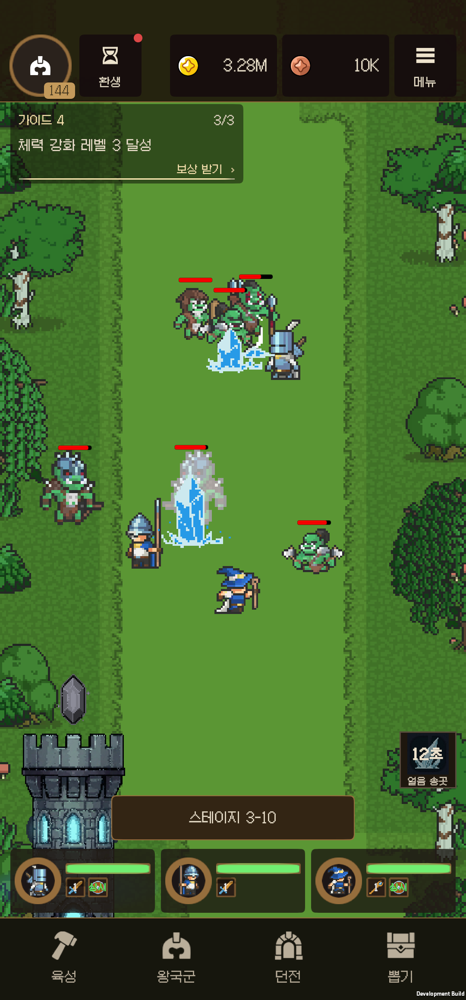
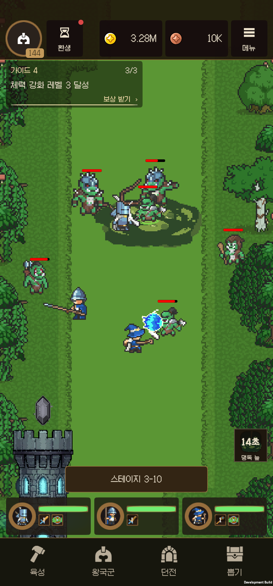
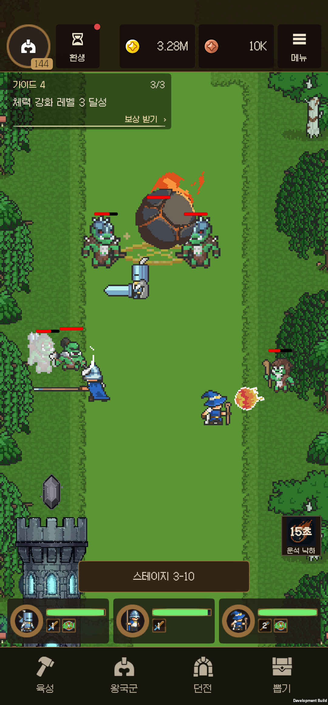
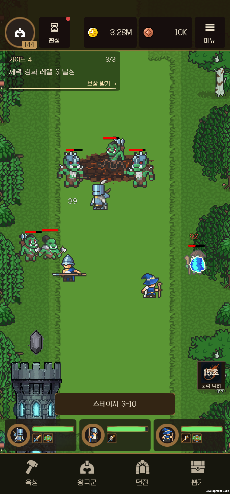
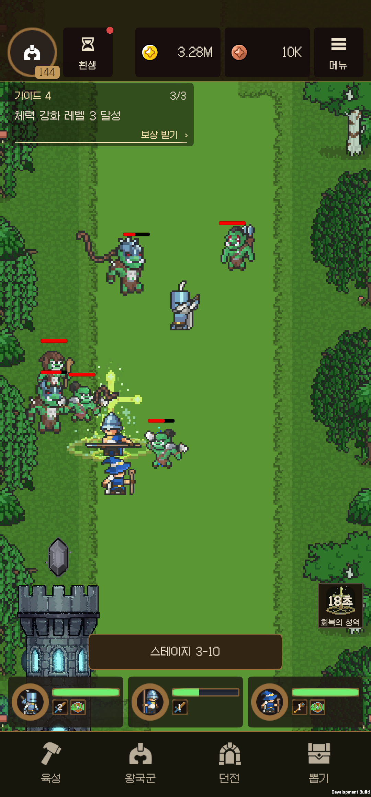
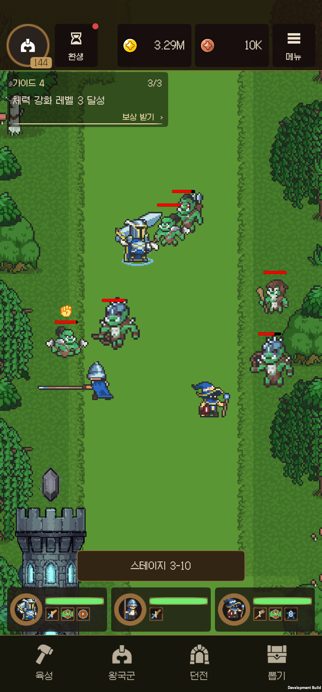
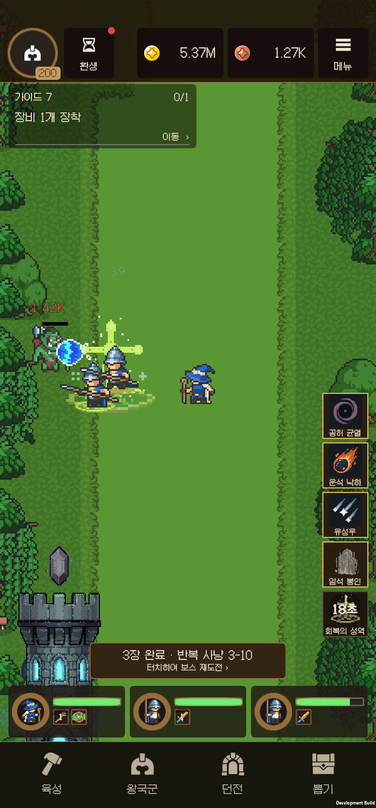

# 전투 스킬 레이어·상태 표시 수정

기준 커밋: `2cce97133` (이전 마탑 개선 작업을 먼저 커밋). Unity 6000.3.21f1, 수정 버전 0.12.1.

## 원인과 변경

- 왕국군은 Default/2인데 지속 장판 일부도 Default/2~3이었다. 같은 레이어 안의 동률·높은 순서 때문에 왕국군 위로 장판이 올라올 수 있었다.
- 기절·감속의 게임 상태는 있었으나 현재 마탑/왕국군 호출은 선택적 상태 VFX를 전달하지 않아 지속 표시가 없었다.
- 회복 파동은 왕국군 루트에 생성됐고 대상을 따라가지 않았다. 활성 병과 5종의 대기 스프라이트 중심 몸체를 측정하니 발은 루트보다 0.5 아래였다.

`CombatVfxOrder`로 아래 순서를 생성기와 실제 프리팹에 반영했다. 배경 타일은 Default/-300~-280, 왕국군은 Default/2, 몬스터는 Enemy 레이어다. 프로젝트 전역 Sorting Layer는 추가/재배열하지 않았다.

| 스킬/구성 | 출력 위치 |
|---|---|
| 라이트닝 / 천벌 벼락·충격 / 뇌운 | CombatVFX/20 이상, 전투원 앞 |
| 얼음 송곳 / 만년빙정 본체 | CombatVFX/20, 전투원 앞 |
| 만년빙정 사전 경고 | Default/-40, 전투원 뒤 |
| 유성우 투사체·충격 | CombatVFX/20, 전투원 앞 |
| 화염 회오리 | Default/-30, 지속 효과가 몸체를 가리지 않음 |
| 맹독 늪의 지면·연무 | Default/-30~-29, 전투원 뒤 |
| 암석 봉인 마법진 / 암석 | 마법진 Default/-40, 솟는 암석 CombatVFX/20~22 |
| 회복의 성역 지면·파동·상징 | Default/-30~-28, 전투원 뒤 |
| 개별 왕국군 회복 파동 | Default/-10, 실제 발밑을 추적 |
| 운석 낙하체·꼬리 / 착탄 폭발 / 크레이터 | 낙하체와 순간 폭발 CombatVFX/20~21, 남는 크레이터 Default/-40 |
| 공허 균열 / 붕괴 순간 | 지속 균열 Default/-30, 순간 붕괴 CombatVFX/20 |

기절 별과 도발 표시는 머리·HP바 위의 별도 줄에 둔다. 함께 적용되면 좌우로 나뉜다. 감속은 발밑 고리이며 맹독은 녹색, 공허는 보라색, 일반 감속은 청색이다. 보호막은 왕국군 발밑 청색 고리로 표시한다. 별도 표시 타이머를 만들지 않고 실제 상태를 읽으므로 강한 감속 종료 후 약한 감속 복귀, 도발 소유자 사망, 보호막 소모/만료, 캐릭터 사망·풀 재사용과 표시가 함께 정리된다.

맹독 늪의 피해는 기존처럼 장판 안에서 발생한다. 표시를 추가하면서 장판 밖에 별도의 중독 피해나 화상 상태를 새로 부여하지 않았다. 만년빙정의 단일 대상 제어는 기존의 2초 기절이다.

## 아트와 비용

기절 별은 보관된 32px 애니메이션 아트만 복사해 재사용했다. 폐기된 신 스킬 코드/로스터는 연결하지 않았다. 도발은 기존 StateEffect의 18px 분노 아이콘, 발밑 고리는 기존 HolyBlessing 64px 시트의 형상·알파를 보존한 중성 명도 작업본을 사용한다. 외부 원본은 수정하지 않았다. 새 이미지 생성 호출과 비용은 0이다. [변환 출처와 해시](Validation/CombatPresentation/art-manifest.json).

표시는 필요한 캐릭터에만 생성하고, 해제 후 SpriteRenderer를 꺼 재사용한다. 진행 중인 상태 표시는 저사양 모드에서도 보존한다. 새 스프라이트는 Point/ASTC 4×4 MageVFX 아틀라스에 포함했다.

## 검증

Unity 프리팹 28개 렌더러의 레이어·상태 아트 참조 및 병과 기준점 검사가 통과했다. [Unity 실행 결과](Validation/CombatPresentation/editor-live.json)는 기본/개화 18회 피해·회복·종료, 상태 표시 21개 검사와 기존 마탑 회귀 검사를 모두 통과했고 오류는 없었다.

SM-N986N, Android IL2CPP 빌드에서 다음을 확인했다.

- b41: 스킬 9종을 각각 시전해 지면/전면 레이어, 양의 피해 또는 회복, 종료를 확인했다. 운석은 낙하와 착탄 후 크레이터를 따로 촬영했다. [스킬별 레이어](Validation/CombatPresentation/b41-spell-layer-checks.json).
- b41: 기사·창병·마법사·정예 기사·정예 마법사를 각각 다치게 한 뒤 실제 성역을 시전했다. 회복 파동이 선택된 대상의 발 기준점과 일치하고 몸보다 뒤에 출력되는 것을 확인했다. [5종 회복 위치](Validation/CombatPresentation/b41-healing-checks.json).
- b41 최초 상태 검사에서 21개 중 이동량 검사 하나가 실패했다. 검사에서 수동으로 더한 0.2만큼 정확히 이동한다고 가정했으나, 전투에는 겹침 해소·경계 제한 이동도 적용된다. 현재 머리 기준점과 표시 위치를 비교하고 실제 이동량을 함께 기록하도록 검사를 수정했다. 최초 실패 기록도 [보존](Validation/CombatPresentation/b41-initial-status-checks.json)했다.
- b42: 21개 상태 검사 전체 통과. 실제 대상과 표시의 x 이동량은 각각 0.200000048, 기준점 오차는 약 0.00000003 월드 단위였다. 기절/감속 동시 적용, 강한 감속 종료 후 약한 감속 복귀, 재적용 연장, 만료, 도발·기절 동시 배치, 보호막 흡수, 사망·부활·풀 재사용 정리를 확인했다. [상태 검사](Validation/CombatPresentation/b42-status-checks.json).
- b42: 일반 적과 보스에서 각각 9개 검사 통과. 첫 도발 유지, 소유자 사망 후 재도발, 보호막 실제 피해 흡수, 왕국군 에너지 파동의 일반 적 기절/보스 기절 면역을 확인했다. [전투 규칙](Validation/CombatPresentation/b42-control-checks.json).
- b42: 720×1280, 1080×2400, 1200×1600에서 기절·도발 동시 표시, 감속·보호막 발밑 표시와 전투 HUD 배치를 촬영·검토했다. 같은 SM-N986N의 화면 크기 override를 바꾼 검사이며, 실제 기기 3대를 사용한 검사가 아니다. 종료 후 1080×2316으로 복구했다. [화면 비율 기록](Validation/CombatPresentation/b42-status-aspect-checks.json).

## 실제 전투 화면

기준 화면은 이번 수정 전 설치되어 있던 b40의 이전 세션 전투 캡처다. 동일 프레임의 비교는 아니다. [수정 전 b40](Validation/CombatPresentation/before-b40-previous-session.png).

| 단발/착탄 순간은 앞 | 지속 지면은 뒤 |
|---|---|
|  |  |
|  |  |

| 발밑 회복 | 도발·보호막 |
|---|---|
|  |  |

## 성능·비용

같은 SM-N986N의 1080×2316 화면에서 라이트닝·맹독 늪·암석 봉인·회복의 성역·공허 균열을 자동 시전하는 전투를 25초씩 측정했다. 저사양 모드에서도 보호막·도발·감속 표시가 남는 것을 별도 캡처로 확인했다. [측정 원문](Validation/CombatPresentation/b42-performance-checks.json).

| b42 모드 | 평균 FPS | p95 프레임 ms | 프로세스 CPU, 1코어 기준 | 평균 draw calls | 종료 Unity 메모리 |
|---|---:|---:|---:|---:|---:|
| 일반 | 59.93 | 16.672 | 86.90% | 30.73 | 166.14 MB |
| 저사양 | 59.85 | 16.675 | 85.54% | 31.22 | 167.14 MB |

60 FPS 제한과 프레임 대기가 포함된 Development ARM64 IL2CPP 표본이다. 적의 배치와 타격량은 완전히 고정하지 않았다. 앞선 마탑 개선의 b39는 다른 스킬 구성에서 일반 59.98 FPS / 33.43 draw calls / 165.22 MB였으며, 이 차이만으로 이번 상태 표시의 성능 개선·퇴화를 단정하지 않는다. 저사양 CPU 차이도 이번 짧은 표본에서는 약 1.6%에 그쳤다. 테스트 후 사용자의 원래 설정을 복구했다.

추가 표시용 스프라이트는 아틀라스로 묶고 캐릭터별로 재사용한다. 비활성 상태에는 갱신을 중단한다. 이번 레이어·상태 표시 후속 작업의 생성 API 지출은 0이며, 이전 운석 제작 비용은 [마탑 개선 기록](MAGE_REVISION_20260919.md)에 별도로 남아 있다.

## 최종 설치·보존

최종 **0.12.1 b43**, 표시 이름 `전투 표시 개선 0.12.1 (b43)`을 SM-N986N에 설치했다. Unity 6000.3.21f1 빌드 성공, 오류 0 / 경고 89(기존 에셋·아틀라스 및 빌드 경고 포함), APK 80,855,986 bytes다. 테스트 명령 처리 코드와 강제 QA 계정 문자열이 APK 메타데이터에 없는 것을 확인했다. [빌드](Validation/CombatPresentation/b43-build.json), [진단 코드 제외·해시](Validation/CombatPresentation/b43-diagnostic-exclusion.json).

실제 타이틀 → 게스트 로그인 → 기존 200레벨 계정 → 전투 → 메뉴/뒤로가기 → 마탑 9종 편성 → 얼음 송곳 각성 상세 → 전투 복귀 → 수동 성역 시전까지 실제 터치와 캡처로 확인했다. 최종 앱에서도 작은 회복 파동이 대상 발밑에서 나오는 것을 확인했고, 이 실행의 Unity/AndroidRuntime 오류는 0이었다. 앱은 전투 상태로 두었다. [최종 실행 검사](Validation/CombatPresentation/b43-final-smoke.json).

진단 전후 QA 외 저장 파일 46개는 바이트가 같았다. 원래 QA 저장 파일과 사용자 preferences를 복원하고 새 진단 파일 228개를 정리했다. 백업은 PC의 무시된 `Recordings/CombatPresentation/Original` 및 `AfterDiagnostic`에 보관한다. 사용자 0의 프로젝트 앱은 하나이며 화면 크기 1080×2316, density 450으로 복구했다. [저장 복원 기록](Validation/CombatPresentation/save-restoration.json).

작업 전 `2cce97133`, 구현·Unity 검증 중간 `a9e9309b5`를 커밋했고, 기기 검증·최종 배포 기록도 완료 커밋으로 남긴다. 다른 실제 기기, iOS, 스토어용 비개발 빌드와 장시간 발열은 이번 검증 범위에 포함하지 않았다.

