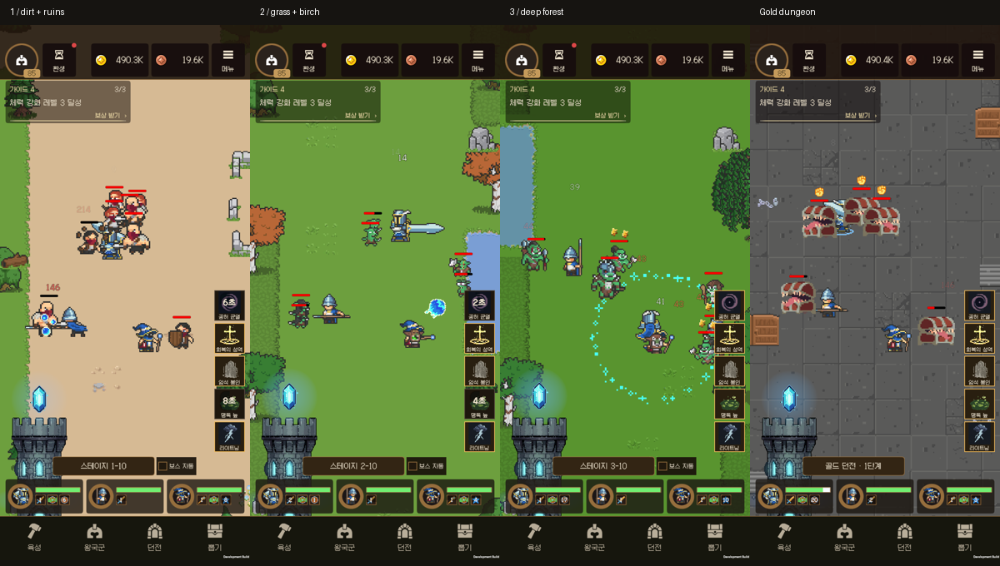

# 환경 프리셋 목록

각 프리팹의 Ground·GroundDetails·Scenery 타일맵을 Unity에서 편집합니다. `Stage_Catalog.xlsx`의 EnvironmentPresets 시트와 `StageBackgroundController`가 90개 프리셋을 선택합니다. 연결 방식은 [통합 안내](INTEGRATION.md), 실제 기기 결과는 [검증 기록](STAGE_INTEGRATION_VALIDATION.md)을 확인합니다.

2026-09-20 개정: 1장은 흙길·통나무·폐허, 2장은 밝은 초원·자작나무·연못, 3장은 짙은 풀길·버드나무·참나무로 구별합니다. 지면의 작은 무늬와 주변의 꽃밭·바위·폐허를 변주하며 골드 던전에는 벽감·기둥·상자, 황무지에는 뼈·고목·독성 연못을 사용합니다. 중앙 장식 제외 영역은 일반/특수 x ±2.1875, 보스 x ±2.625입니다. 90개 기존 ID와 Ground·GroundDetails·Scenery 3개 타일맵을 유지하고 장식 충돌체를 만들지 않습니다. 배치·시드·타일 수는 [환경 manifest](Manifests/environment-presets.json), 재생성은 `EnvironmentRichnessPreparation.Prepare`를 따릅니다.

이전 [환경 갤러리](Previews/environment-gallery.png)와 [3스테이지 18종](Previews/stage3-preset-gallery.png)은 통합 전 PreviewScene 기록입니다. 현재 인게임 화면은 아래와 같습니다.

검은 바닥 틈이 있던 b51에서 벽 경계용 투명 타일을 제외하고 b52에서 재확인했습니다. 연못의 잔디 바탕이 흙 위에서 사각형으로 드러난 구성은 폐허로 교체했습니다.

| 풀 | 분류 | 이름·구도 | 프리팹 |
|---|---|---|---|
| Stage01_ForestDirt | Main | TimberAndRuins | [Stage01_ForestDirt_Main_01](<../../Assets/_Project/Prefabs/Environment/Prepared/Stage01_ForestDirt/Main/Stage01_ForestDirt_Main_01.prefab>) |
| Stage01_ForestDirt | Main | MeadowAndTimber | [Stage01_ForestDirt_Main_02](<../../Assets/_Project/Prefabs/Environment/Prepared/Stage01_ForestDirt/Main/Stage01_ForestDirt_Main_02.prefab>) |
| Stage01_ForestDirt | Main | MossyRuins | [Stage01_ForestDirt_Main_03](<../../Assets/_Project/Prefabs/Environment/Prepared/Stage01_ForestDirt/Main/Stage01_ForestDirt_Main_03.prefab>) |
| Stage01_ForestDirt | Main | TimberAndRuins | [Stage01_ForestDirt_Main_04](<../../Assets/_Project/Prefabs/Environment/Prepared/Stage01_ForestDirt/Main/Stage01_ForestDirt_Main_04.prefab>) |
| Stage01_ForestDirt | Main | StoneGarden | [Stage01_ForestDirt_Main_05](<../../Assets/_Project/Prefabs/Environment/Prepared/Stage01_ForestDirt/Main/Stage01_ForestDirt_Main_05.prefab>) |
| Stage01_ForestDirt | Main | TimberAndRuins | [Stage01_ForestDirt_Main_06](<../../Assets/_Project/Prefabs/Environment/Prepared/Stage01_ForestDirt/Main/Stage01_ForestDirt_Main_06.prefab>) |
| Stage01_ForestDirt | Main | BrokenWall | [Stage01_ForestDirt_Main_07](<../../Assets/_Project/Prefabs/Environment/Prepared/Stage01_ForestDirt/Main/Stage01_ForestDirt_Main_07.prefab>) |
| Stage01_ForestDirt | Main | OldOakClearing | [Stage01_ForestDirt_Main_08](<../../Assets/_Project/Prefabs/Environment/Prepared/Stage01_ForestDirt/Main/Stage01_ForestDirt_Main_08.prefab>) |
| Stage01_ForestDirt | Main | TimberAndRuins | [Stage01_ForestDirt_Main_09](<../../Assets/_Project/Prefabs/Environment/Prepared/Stage01_ForestDirt/Main/Stage01_ForestDirt_Main_09.prefab>) |
| Stage01_ForestDirt | Main | WoodlandRemains | [Stage01_ForestDirt_Main_10](<../../Assets/_Project/Prefabs/Environment/Prepared/Stage01_ForestDirt/Main/Stage01_ForestDirt_Main_10.prefab>) |
| Stage01_ForestDirt | Boss | TimberAndRuins | [Stage01_ForestDirt_Boss_01](<../../Assets/_Project/Prefabs/Environment/Prepared/Stage01_ForestDirt/Boss/Stage01_ForestDirt_Boss_01.prefab>) |
| Stage01_ForestDirt | Boss | MeadowAndTimber | [Stage01_ForestDirt_Boss_02](<../../Assets/_Project/Prefabs/Environment/Prepared/Stage01_ForestDirt/Boss/Stage01_ForestDirt_Boss_02.prefab>) |
| Stage01_ForestDirt | Boss | MossyRuins | [Stage01_ForestDirt_Boss_03](<../../Assets/_Project/Prefabs/Environment/Prepared/Stage01_ForestDirt/Boss/Stage01_ForestDirt_Boss_03.prefab>) |
| Stage01_ForestDirt | Special | TimberAndRuins | [Stage01_ForestDirt_Special_01](<../../Assets/_Project/Prefabs/Environment/Prepared/Stage01_ForestDirt/Special/Stage01_ForestDirt_Special_01.prefab>) |
| Stage01_ForestDirt | Special | MeadowAndTimber | [Stage01_ForestDirt_Special_02](<../../Assets/_Project/Prefabs/Environment/Prepared/Stage01_ForestDirt/Special/Stage01_ForestDirt_Special_02.prefab>) |
| Stage01_ForestDirt | Special | MossyRuins | [Stage01_ForestDirt_Special_03](<../../Assets/_Project/Prefabs/Environment/Prepared/Stage01_ForestDirt/Special/Stage01_ForestDirt_Special_03.prefab>) |
| Stage01_ForestDirt | Special | TimberAndRuins | [Stage01_ForestDirt_Special_04](<../../Assets/_Project/Prefabs/Environment/Prepared/Stage01_ForestDirt/Special/Stage01_ForestDirt_Special_04.prefab>) |
| Stage01_ForestDirt | Special | StoneGarden | [Stage01_ForestDirt_Special_05](<../../Assets/_Project/Prefabs/Environment/Prepared/Stage01_ForestDirt/Special/Stage01_ForestDirt_Special_05.prefab>) |
| Stage02_ForestGrass | Main | BirchPond | [Stage02_ForestGrass_Main_01](<../../Assets/_Project/Prefabs/Environment/Prepared/Stage02_ForestGrass/Main/Stage02_ForestGrass_Main_01.prefab>) |
| Stage02_ForestGrass | Main | StoneGarden | [Stage02_ForestGrass_Main_02](<../../Assets/_Project/Prefabs/Environment/Prepared/Stage02_ForestGrass/Main/Stage02_ForestGrass_Main_02.prefab>) |
| Stage02_ForestGrass | Main | FlowerGrove | [Stage02_ForestGrass_Main_03](<../../Assets/_Project/Prefabs/Environment/Prepared/Stage02_ForestGrass/Main/Stage02_ForestGrass_Main_03.prefab>) |
| Stage02_ForestGrass | Main | BrokenWall | [Stage02_ForestGrass_Main_04](<../../Assets/_Project/Prefabs/Environment/Prepared/Stage02_ForestGrass/Main/Stage02_ForestGrass_Main_04.prefab>) |
| Stage02_ForestGrass | Main | OldOakClearing | [Stage02_ForestGrass_Main_05](<../../Assets/_Project/Prefabs/Environment/Prepared/Stage02_ForestGrass/Main/Stage02_ForestGrass_Main_05.prefab>) |
| Stage02_ForestGrass | Main | MushroomBank | [Stage02_ForestGrass_Main_06](<../../Assets/_Project/Prefabs/Environment/Prepared/Stage02_ForestGrass/Main/Stage02_ForestGrass_Main_06.prefab>) |
| Stage02_ForestGrass | Main | WoodlandRemains | [Stage02_ForestGrass_Main_07](<../../Assets/_Project/Prefabs/Environment/Prepared/Stage02_ForestGrass/Main/Stage02_ForestGrass_Main_07.prefab>) |
| Stage02_ForestGrass | Main | WatersideBend | [Stage02_ForestGrass_Main_08](<../../Assets/_Project/Prefabs/Environment/Prepared/Stage02_ForestGrass/Main/Stage02_ForestGrass_Main_08.prefab>) |
| Stage02_ForestGrass | Main | MeadowAndTimber | [Stage02_ForestGrass_Main_09](<../../Assets/_Project/Prefabs/Environment/Prepared/Stage02_ForestGrass/Main/Stage02_ForestGrass_Main_09.prefab>) |
| Stage02_ForestGrass | Main | MossyRuins | [Stage02_ForestGrass_Main_10](<../../Assets/_Project/Prefabs/Environment/Prepared/Stage02_ForestGrass/Main/Stage02_ForestGrass_Main_10.prefab>) |
| Stage02_ForestGrass | Boss | BirchPond | [Stage02_ForestGrass_Boss_01](<../../Assets/_Project/Prefabs/Environment/Prepared/Stage02_ForestGrass/Boss/Stage02_ForestGrass_Boss_01.prefab>) |
| Stage02_ForestGrass | Boss | StoneGarden | [Stage02_ForestGrass_Boss_02](<../../Assets/_Project/Prefabs/Environment/Prepared/Stage02_ForestGrass/Boss/Stage02_ForestGrass_Boss_02.prefab>) |
| Stage02_ForestGrass | Boss | FlowerGrove | [Stage02_ForestGrass_Boss_03](<../../Assets/_Project/Prefabs/Environment/Prepared/Stage02_ForestGrass/Boss/Stage02_ForestGrass_Boss_03.prefab>) |
| Stage02_ForestGrass | Special | BirchPond | [Stage02_ForestGrass_Special_01](<../../Assets/_Project/Prefabs/Environment/Prepared/Stage02_ForestGrass/Special/Stage02_ForestGrass_Special_01.prefab>) |
| Stage02_ForestGrass | Special | StoneGarden | [Stage02_ForestGrass_Special_02](<../../Assets/_Project/Prefabs/Environment/Prepared/Stage02_ForestGrass/Special/Stage02_ForestGrass_Special_02.prefab>) |
| Stage02_ForestGrass | Special | FlowerGrove | [Stage02_ForestGrass_Special_03](<../../Assets/_Project/Prefabs/Environment/Prepared/Stage02_ForestGrass/Special/Stage02_ForestGrass_Special_03.prefab>) |
| Stage02_ForestGrass | Special | BrokenWall | [Stage02_ForestGrass_Special_04](<../../Assets/_Project/Prefabs/Environment/Prepared/Stage02_ForestGrass/Special/Stage02_ForestGrass_Special_04.prefab>) |
| Stage02_ForestGrass | Special | OldOakClearing | [Stage02_ForestGrass_Special_05](<../../Assets/_Project/Prefabs/Environment/Prepared/Stage02_ForestGrass/Special/Stage02_ForestGrass_Special_05.prefab>) |
| Stage03_DeepForest | Main | BrokenWall | [Stage03_DeepForest_Main_01](<../../Assets/_Project/Prefabs/Environment/Prepared/Stage03_DeepForest/Main/Stage03_DeepForest_Main_01.prefab>) |
| Stage03_DeepForest | Main | OldOakClearing | [Stage03_DeepForest_Main_02](<../../Assets/_Project/Prefabs/Environment/Prepared/Stage03_DeepForest/Main/Stage03_DeepForest_Main_02.prefab>) |
| Stage03_DeepForest | Main | MushroomBank | [Stage03_DeepForest_Main_03](<../../Assets/_Project/Prefabs/Environment/Prepared/Stage03_DeepForest/Main/Stage03_DeepForest_Main_03.prefab>) |
| Stage03_DeepForest | Main | WoodlandRemains | [Stage03_DeepForest_Main_04](<../../Assets/_Project/Prefabs/Environment/Prepared/Stage03_DeepForest/Main/Stage03_DeepForest_Main_04.prefab>) |
| Stage03_DeepForest | Main | WatersideBend | [Stage03_DeepForest_Main_05](<../../Assets/_Project/Prefabs/Environment/Prepared/Stage03_DeepForest/Main/Stage03_DeepForest_Main_05.prefab>) |
| Stage03_DeepForest | Main | MeadowAndTimber | [Stage03_DeepForest_Main_06](<../../Assets/_Project/Prefabs/Environment/Prepared/Stage03_DeepForest/Main/Stage03_DeepForest_Main_06.prefab>) |
| Stage03_DeepForest | Main | MossyRuins | [Stage03_DeepForest_Main_07](<../../Assets/_Project/Prefabs/Environment/Prepared/Stage03_DeepForest/Main/Stage03_DeepForest_Main_07.prefab>) |
| Stage03_DeepForest | Main | BirchPond | [Stage03_DeepForest_Main_08](<../../Assets/_Project/Prefabs/Environment/Prepared/Stage03_DeepForest/Main/Stage03_DeepForest_Main_08.prefab>) |
| Stage03_DeepForest | Main | StoneGarden | [Stage03_DeepForest_Main_09](<../../Assets/_Project/Prefabs/Environment/Prepared/Stage03_DeepForest/Main/Stage03_DeepForest_Main_09.prefab>) |
| Stage03_DeepForest | Main | FlowerGrove | [Stage03_DeepForest_Main_10](<../../Assets/_Project/Prefabs/Environment/Prepared/Stage03_DeepForest/Main/Stage03_DeepForest_Main_10.prefab>) |
| Stage03_DeepForest | Boss | BrokenWall | [Stage03_DeepForest_Boss_01](<../../Assets/_Project/Prefabs/Environment/Prepared/Stage03_DeepForest/Boss/Stage03_DeepForest_Boss_01.prefab>) |
| Stage03_DeepForest | Boss | OldOakClearing | [Stage03_DeepForest_Boss_02](<../../Assets/_Project/Prefabs/Environment/Prepared/Stage03_DeepForest/Boss/Stage03_DeepForest_Boss_02.prefab>) |
| Stage03_DeepForest | Boss | MushroomBank | [Stage03_DeepForest_Boss_03](<../../Assets/_Project/Prefabs/Environment/Prepared/Stage03_DeepForest/Boss/Stage03_DeepForest_Boss_03.prefab>) |
| Stage03_DeepForest | Special | BrokenWall | [Stage03_DeepForest_Special_01](<../../Assets/_Project/Prefabs/Environment/Prepared/Stage03_DeepForest/Special/Stage03_DeepForest_Special_01.prefab>) |
| Stage03_DeepForest | Special | OldOakClearing | [Stage03_DeepForest_Special_02](<../../Assets/_Project/Prefabs/Environment/Prepared/Stage03_DeepForest/Special/Stage03_DeepForest_Special_02.prefab>) |
| Stage03_DeepForest | Special | MushroomBank | [Stage03_DeepForest_Special_03](<../../Assets/_Project/Prefabs/Environment/Prepared/Stage03_DeepForest/Special/Stage03_DeepForest_Special_03.prefab>) |
| Stage03_DeepForest | Special | WoodlandRemains | [Stage03_DeepForest_Special_04](<../../Assets/_Project/Prefabs/Environment/Prepared/Stage03_DeepForest/Special/Stage03_DeepForest_Special_04.prefab>) |
| Stage03_DeepForest | Special | WatersideBend | [Stage03_DeepForest_Special_05](<../../Assets/_Project/Prefabs/Environment/Prepared/Stage03_DeepForest/Special/Stage03_DeepForest_Special_05.prefab>) |
| GoldDungeon | Main | PillaredVault | [GoldDungeon_Main_01](<../../Assets/_Project/Prefabs/Environment/Prepared/GoldDungeon/Main/GoldDungeon_Main_01.prefab>) |
| GoldDungeon | Main | BrokenGallery | [GoldDungeon_Main_02](<../../Assets/_Project/Prefabs/Environment/Prepared/GoldDungeon/Main/GoldDungeon_Main_02.prefab>) |
| GoldDungeon | Main | SupplyAlcove | [GoldDungeon_Main_03](<../../Assets/_Project/Prefabs/Environment/Prepared/GoldDungeon/Main/GoldDungeon_Main_03.prefab>) |
| GoldDungeon | Main | QuietCrypt | [GoldDungeon_Main_04](<../../Assets/_Project/Prefabs/Environment/Prepared/GoldDungeon/Main/GoldDungeon_Main_04.prefab>) |
| GoldDungeon | Main | VineHall | [GoldDungeon_Main_05](<../../Assets/_Project/Prefabs/Environment/Prepared/GoldDungeon/Main/GoldDungeon_Main_05.prefab>) |
| GoldDungeon | Main | PillaredVault | [GoldDungeon_Main_06](<../../Assets/_Project/Prefabs/Environment/Prepared/GoldDungeon/Main/GoldDungeon_Main_06.prefab>) |
| GoldDungeon | Main | BrokenGallery | [GoldDungeon_Main_07](<../../Assets/_Project/Prefabs/Environment/Prepared/GoldDungeon/Main/GoldDungeon_Main_07.prefab>) |
| GoldDungeon | Main | SupplyAlcove | [GoldDungeon_Main_08](<../../Assets/_Project/Prefabs/Environment/Prepared/GoldDungeon/Main/GoldDungeon_Main_08.prefab>) |
| GoldDungeon | Main | QuietCrypt | [GoldDungeon_Main_09](<../../Assets/_Project/Prefabs/Environment/Prepared/GoldDungeon/Main/GoldDungeon_Main_09.prefab>) |
| GoldDungeon | Main | VineHall | [GoldDungeon_Main_10](<../../Assets/_Project/Prefabs/Environment/Prepared/GoldDungeon/Main/GoldDungeon_Main_10.prefab>) |
| GoldDungeon | Boss | PillaredVault | [GoldDungeon_Boss_01](<../../Assets/_Project/Prefabs/Environment/Prepared/GoldDungeon/Boss/GoldDungeon_Boss_01.prefab>) |
| GoldDungeon | Boss | BrokenGallery | [GoldDungeon_Boss_02](<../../Assets/_Project/Prefabs/Environment/Prepared/GoldDungeon/Boss/GoldDungeon_Boss_02.prefab>) |
| GoldDungeon | Boss | SupplyAlcove | [GoldDungeon_Boss_03](<../../Assets/_Project/Prefabs/Environment/Prepared/GoldDungeon/Boss/GoldDungeon_Boss_03.prefab>) |
| GoldDungeon | Special | PillaredVault | [GoldDungeon_Special_01](<../../Assets/_Project/Prefabs/Environment/Prepared/GoldDungeon/Special/GoldDungeon_Special_01.prefab>) |
| GoldDungeon | Special | BrokenGallery | [GoldDungeon_Special_02](<../../Assets/_Project/Prefabs/Environment/Prepared/GoldDungeon/Special/GoldDungeon_Special_02.prefab>) |
| GoldDungeon | Special | SupplyAlcove | [GoldDungeon_Special_03](<../../Assets/_Project/Prefabs/Environment/Prepared/GoldDungeon/Special/GoldDungeon_Special_03.prefab>) |
| GoldDungeon | Special | QuietCrypt | [GoldDungeon_Special_04](<../../Assets/_Project/Prefabs/Environment/Prepared/GoldDungeon/Special/GoldDungeon_Special_04.prefab>) |
| GoldDungeon | Special | VineHall | [GoldDungeon_Special_05](<../../Assets/_Project/Prefabs/Environment/Prepared/GoldDungeon/Special/GoldDungeon_Special_05.prefab>) |
| RubyWasteland | Main | DryRiverbank | [RubyWasteland_Main_01](<../../Assets/_Project/Prefabs/Environment/Prepared/RubyWasteland/Main/RubyWasteland_Main_01.prefab>) |
| RubyWasteland | Main | BoneField | [RubyWasteland_Main_02](<../../Assets/_Project/Prefabs/Environment/Prepared/RubyWasteland/Main/RubyWasteland_Main_02.prefab>) |
| RubyWasteland | Main | AncientStumps | [RubyWasteland_Main_03](<../../Assets/_Project/Prefabs/Environment/Prepared/RubyWasteland/Main/RubyWasteland_Main_03.prefab>) |
| RubyWasteland | Main | RockPass | [RubyWasteland_Main_04](<../../Assets/_Project/Prefabs/Environment/Prepared/RubyWasteland/Main/RubyWasteland_Main_04.prefab>) |
| RubyWasteland | Main | RuinedOutpost | [RubyWasteland_Main_05](<../../Assets/_Project/Prefabs/Environment/Prepared/RubyWasteland/Main/RubyWasteland_Main_05.prefab>) |
| RubyWasteland | Main | DryRiverbank | [RubyWasteland_Main_06](<../../Assets/_Project/Prefabs/Environment/Prepared/RubyWasteland/Main/RubyWasteland_Main_06.prefab>) |
| RubyWasteland | Main | BoneField | [RubyWasteland_Main_07](<../../Assets/_Project/Prefabs/Environment/Prepared/RubyWasteland/Main/RubyWasteland_Main_07.prefab>) |
| RubyWasteland | Main | AncientStumps | [RubyWasteland_Main_08](<../../Assets/_Project/Prefabs/Environment/Prepared/RubyWasteland/Main/RubyWasteland_Main_08.prefab>) |
| RubyWasteland | Main | RockPass | [RubyWasteland_Main_09](<../../Assets/_Project/Prefabs/Environment/Prepared/RubyWasteland/Main/RubyWasteland_Main_09.prefab>) |
| RubyWasteland | Main | RuinedOutpost | [RubyWasteland_Main_10](<../../Assets/_Project/Prefabs/Environment/Prepared/RubyWasteland/Main/RubyWasteland_Main_10.prefab>) |
| RubyWasteland | Boss | DryRiverbank | [RubyWasteland_Boss_01](<../../Assets/_Project/Prefabs/Environment/Prepared/RubyWasteland/Boss/RubyWasteland_Boss_01.prefab>) |
| RubyWasteland | Boss | BoneField | [RubyWasteland_Boss_02](<../../Assets/_Project/Prefabs/Environment/Prepared/RubyWasteland/Boss/RubyWasteland_Boss_02.prefab>) |
| RubyWasteland | Boss | AncientStumps | [RubyWasteland_Boss_03](<../../Assets/_Project/Prefabs/Environment/Prepared/RubyWasteland/Boss/RubyWasteland_Boss_03.prefab>) |
| RubyWasteland | Special | DryRiverbank | [RubyWasteland_Special_01](<../../Assets/_Project/Prefabs/Environment/Prepared/RubyWasteland/Special/RubyWasteland_Special_01.prefab>) |
| RubyWasteland | Special | BoneField | [RubyWasteland_Special_02](<../../Assets/_Project/Prefabs/Environment/Prepared/RubyWasteland/Special/RubyWasteland_Special_02.prefab>) |
| RubyWasteland | Special | AncientStumps | [RubyWasteland_Special_03](<../../Assets/_Project/Prefabs/Environment/Prepared/RubyWasteland/Special/RubyWasteland_Special_03.prefab>) |
| RubyWasteland | Special | RockPass | [RubyWasteland_Special_04](<../../Assets/_Project/Prefabs/Environment/Prepared/RubyWasteland/Special/RubyWasteland_Special_04.prefab>) |
| RubyWasteland | Special | RuinedOutpost | [RubyWasteland_Special_05](<../../Assets/_Project/Prefabs/Environment/Prepared/RubyWasteland/Special/RubyWasteland_Special_05.prefab>) |
