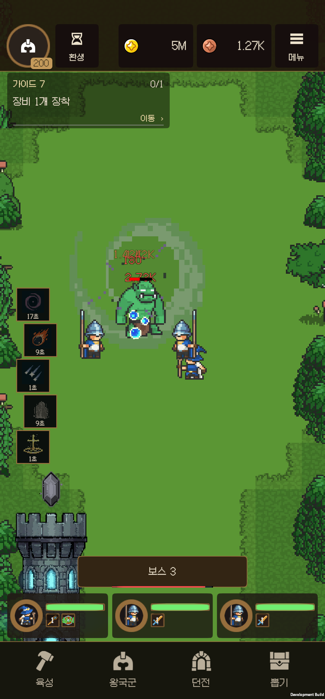
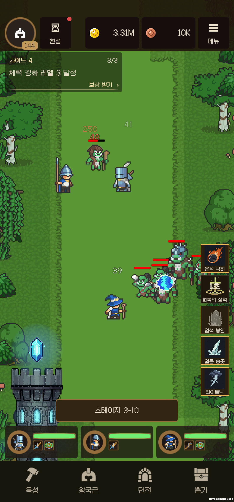
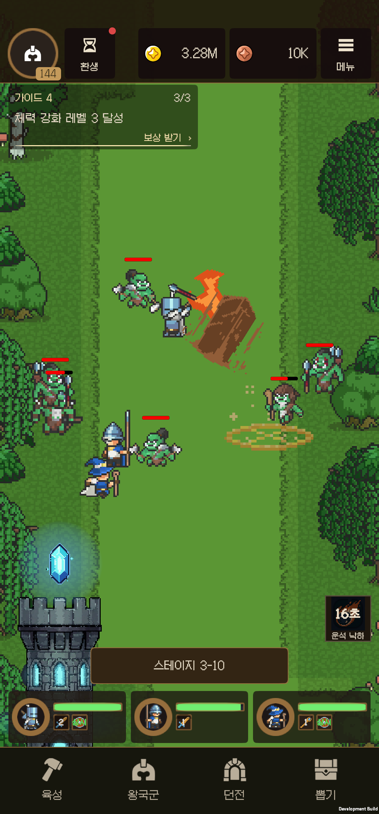
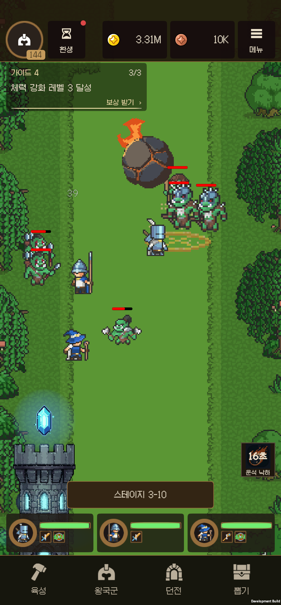
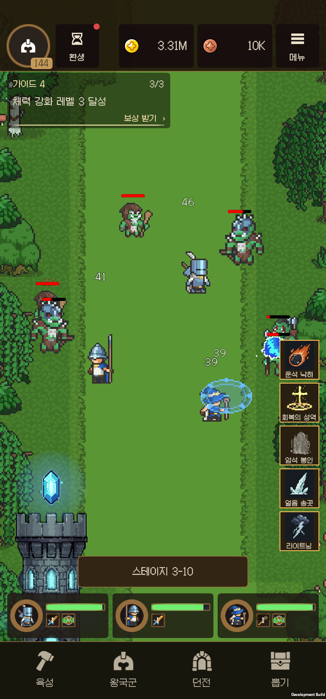
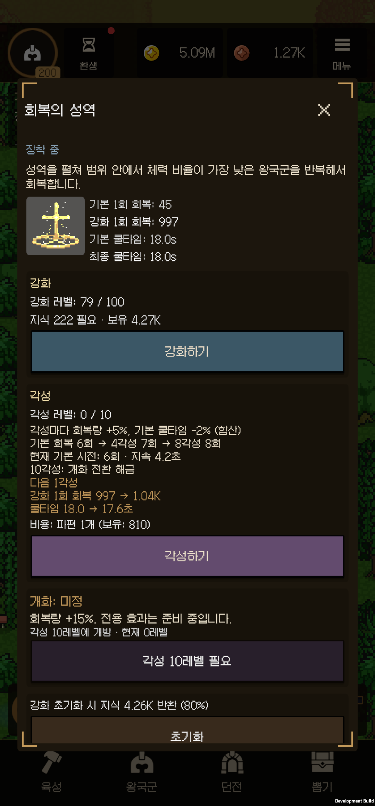

# 마탑 수동 시전·스킬 연출 개정

대상 버전 0.12.0. Unity 6000.3.21f1. 실기기 SM-N986N 한 대에서 검증한다. 화면 비율 검사는 같은 기기의 해상도 override이며 여러 실제 기기 검증으로 간주하지 않는다.

## 변경

- 수동 아이콘: 우측 스테이지 인디케이터 위에 장착한 스킬만 정렬. 기본 132 논리 px, 최소 116px, 간격 10px. 안전 영역과 스테이지 HUD 이동을 따라간다. 짧은 화면에서는 필요한 경우 열을 늘려 터치 영역을 지킨다.
- 자동시전 전환: 0.46초의 unscaled-time 순차 등장/역방향 퇴장. 퇴장 중 입력 차단, 중간에 방향을 바꿔도 현재 진행률에서 이어진다. 팝업·화면 복귀 시 상태를 복구한다.
- 준비 상태의 청동색 테두리를 밝히고 쿨타임에는 아이콘을 약하게 어둡게 표시한다. 12시부터 시계방향으로 걷히는 Radial360 덮개와 남은 초를 표시한다.
- 조준: 실제 시전 반경을 기준으로 가로 지름을 유지하고 세로를 0.64배로 눕힌 마법진. 32px/월드 단위 격자의 scanline quad로 도트 경계를 만들며 텍스처를 추가하지 않는다. 얼음 송곳·유성우는 드래그로 시전하거나 쿨타임을 소비하지 않는다.
- 상세 메뉴: 매 각성의 피해/회복 +5%, 기본 쿨타임 -2% 합산, 4·8각성 횟수 증가, 현재 횟수·지속시간, 다음 각성 수치와 10각성 개화 해금을 표시한다. 운석은 횟수 증가가 없음을 별도로 표시한다.
- 질풍 칼날: 런타임 로스터·뽑기·코드 경로·프리팹·아이콘에서 제거. ID 6을 재사용하지 않고 0–5·7–9를 유지한다. 이전 저장의 장착만 해제하고 투자 기록은 보존한다. 9종은 동등 확률이며 전체 스킬 보상 비중 50%는 유지한다. 운영 XLSX와 README도 갱신했다.
- 성역: 0.32초 상승 → 회복 파동 중 문양 높이 유지 → 0.32초 하강. 십자 문양은 고정 프레임이며 지면/회복 파동만 반복한다.
- 운석: 작은 원형 마스크를 매 프레임 돌리는 방식 대신 64px·6색 몸체를 사용한다. 기존 불꽃 클립과 가속 낙하를 결합한다. 크레이터 3.8×2.6 → 3.2×2.25 월드 단위, 위에 얹혀 있던 두 불길 레이어 제거, 착탄 폭발도 축소했다.
- 암석 봉인: 노란 마법진의 과도한 확대 6.2×3.8 → 3.2×3.2를 줄였다. 암석은 원본 64px 시트의 균열 디테일을 유지한다.
- 공허 균열: 잘라 확대한 파생 시트에서 원본 시트로 복귀하고 색을 억제했다. 원래의 원형 실루엣을 유지한다. 흡입 반경 1.3 → 1.95, 피해·붕괴 반경 1.3 유지. 수동 조준은 흡입 반경을 표시한다.

## 아트·비용·렌더링

[Comfy 공정과 프롬프트](../../AI/comfyui/mage-skills/20260919-revision/README.md), [전체 픽셀 검사](Validation/MageRevision/pixel-audit.json).

각 레이어의 원본 rect, PPU, 실제 world pixel 크기, 필터와 텍스처 크기를 확인했다. 모든 스킬의 실제 전투 화면을 검토했다. 몸체/투사체는 대체로 0.025–0.041 월드 단위/px, 지면은 약 0.05다. 큰 개화와 균열은 0.053–0.072가 남는다. 같은 원본도 연출 크기·프레임의 연결 픽셀 수가 달라 완전히 동일한 픽셀 크기라고 주장하지 않는다. 큰 효과의 실루엣을 훼손하는 일괄 축소는 피하고 눈에 띈 확대·왜곡을 우선 교정했다.

새 몸체는 64×64 한 장, 6색·이진 알파·Point이며 빌드용 MageVFX 아틀라스에 포함했다. UI 아이콘은 기존 48px를 유지한다. 불필요한 운석 크레이터 렌더러 2개를 없앴고, HUD는 값이 변할 때만 Transform·텍스트를 갱신한다. 기존 VFX 풀을 사용한다.

Comfy는 운석 몸체 한 장만 생성했다. 사전 견적 약 18 credits/image, 실행 후 billing 표시 17.2 credits. 최종 `get_usage_report`에서 실행 시간 구간(11:00–12:00 UTC)의 실제 청구 기반 합계 **$0.0815334**를 확인했다. 작업별 크레딧 표시와 시간 구간의 달러 청구 합계를 구분하며 서비스가 작업 ID별 달러액을 직접 제공한다고 해석하지 않는다.

## 검사와 수정 이력

1. 수정 전 b37 화면 및 저장 파일을 백업했다. 개인 홈 화면 캡처는 보관하지 않았다.
2. Unity에서 SO·프리팹·참조를 실제 재생성하고 102개 밸런스 검사 및 9종 로스터·동등 확률·직렬화 UI 참조를 확인했다.
3. 기본/개화 18개 시전에서 양의 피해/회복과 종료 처리를 모두 확인했다. 첫 실행의 UI 퇴장 검사는 첫 슬롯의 의도된 역순 지연 전에 측정해 실패했다. 먼저 움직이는 마지막 슬롯을 측정하도록 수정한 재검사가 통과했다. 원래 실패 기록을 보존했다.
4. Android b38에서 기본 9종, 실제 탭 시전, 쿨타임, 상세 정보, 자동시전 숨김·재등장을 확인했다. 드래그 검사에서 트레이 재부모화 후 부모 HUD 연결이 없어진 문제를 발견하고 명시적 바인딩으로 수정했다.
5. b38 운석의 EarthRock 재사용안은 돌기둥 실루엣으로 보여 기각했다. 새 64px 몸체로 교체했다. 상세 메뉴 뒤에 남던 아이콘과 과도한 쿨타임 어두움을 함께 수정했다.
6. 720×1280·1080×2400·1200×1600 override에서 터치 영역 겹침과 화면 밖 배치를 확인했다. 태블릿에서 가이드 높이를 불필요하게 피하던 제약을 고쳐 우측 공간을 활용한다.
7. 최종 Unity 수동 UI/저장·로스터 검사: **189개 통과**, 시간 정지 중 퇴장/도중 반전/팝업 복귀 통과. 자세한 결과는 `Validation/MageRevision/editor-final-manual.json`.

8. Android b39 재검증: 실제 탭/드래그 시전, 무작위 얼음 송곳 드래그 거부, 쿨타임 소비 규칙, 자동 복귀, 팝업 억제 통과. 변경한 성역·운석·균열은 피해/회복과 종료를 다시 확인했다. 성역의 두 유지 시점에서 `HolyCross_2`, localPosition `(0, 0.55)`가 같았고, 회복 45×6 후 종료됐다.
9. b39의 3개 화면 비율에서 아이콘 5개의 x 좌표가 일치해 한 줄 정렬을 확인했다. 해상도는 검증 후 1080×2316으로 복구했다.

## 성능 측정

같은 SM-N986N, 1080×2316, IL2CPP Development ARM64, 전투 자동시전 25초씩 측정했다. 프레임 페이싱이 60 FPS이므로 CPU main-thread 시간에는 대기가 포함된다. 적의 움직임과 피해량 표시량을 완전히 고정한 벤치마크는 아니다.

| 후보 | 모드 | 평균 FPS | p95 프레임 ms | 프로세스 CPU, 코어 1개 기준 | 평균 draw calls | 종료 Unity 메모리 |
|---|---|---:|---:|---:|---:|---:|
| b38 1차 | 일반 | 59.87 | 16.671 | 85.99% | 33.95 | 167.32 MB |
| b38 1차 | 저사양 | 59.79 | 측정 JSON 참고 | 83.0% | 33.9 | 167.69 MB |
| b39 재검증 | 일반 | 59.98 | 16.666 | 87.93% | 33.43 | 165.22 MB |
| b39 재검증 | 저사양 | 59.94 | 16.668 | 84.30% | 33.28 | 166.53 MB |

최종 후보는 두 모드에서 약 60 FPS를 유지했다. 저사양 모드의 프로세스 CPU 사용률은 이 표본에서 약 4% 낮았고, 시전·회복·터치 기능은 유지됐다. 메모리 표본 차이를 누수 감소의 증거로 해석하지 않는다. 원래 b37은 진단 기능이 없는 앱이라 동일 계측기의 수정 전 성능 수치는 없으며 b38을 원본 성능으로 표시하지 않았다.

기록: [기능](Validation/MageRevision/b39-manual-checks.json), [조준](Validation/MageRevision/b39-aim-checks.json), [성역](Validation/MageRevision/b39-sustain-checks.json), [화면 비율](Validation/MageRevision/b39-aspect-checks.json), [성능](Validation/MageRevision/b39-performance-checks.json).

## 화면 비교

| 수정 전 | 수정 후 |
|---|---|
|  |  |
|  |  |

## 최종 설치와 저장 데이터 보존

0.12.0 **b40** `마탑 개선` 앱을 SM-N986N에 설치했다. QA 진단 코드와 강제 계정 지정이 없는 APK임을 메타데이터로 확인했다. 실제 타이틀 → 게스트 로그인 → 기존 200레벨 계정 → 전투 → 메뉴 → 마탑 9종 편성 → 각성 상세 정보 → 뒤로가기 전투 복귀를 실제 터치와 캡처로 확인했다. 이 실행의 Unity 로그에 예외/오류는 없었다. 앱은 사용자가 바로 플레이할 수 있는 전투 상태로 두었다.

원래 preferences와 QA 저장 파일을 복구했고, QA 외 저장 파일 46개는 진단 전후 바이트가 일치했다. 진단 파일 167개를 정리했으며 진단 후 저장 파일 백업은 PC의 무시된 Recordings 경로에 보관했다. 현재 사용자 프로필의 프로젝트 앱은 하나뿐이다. 기기 화면 override는 원래의 1080×2316, density 450으로 복구했다. 여러 실제 기기를 사용한 검사가 아니라 같은 기기의 화면 크기 override로 세 비율을 검증했다.

기록: [최종 실행 검사](Validation/MageRevision/b40-final-smoke.json), [설치 빌드](Validation/MageRevision/b40-build.json), [진단 코드 제외](Validation/MageRevision/b40-diagnostic-exclusion.json), [저장 복원](Validation/MageRevision/save-restoration.json).

미검증 범위는 다른 실제 기기, iOS, 스토어 배포 빌드 및 장시간 발열 시험이다.
