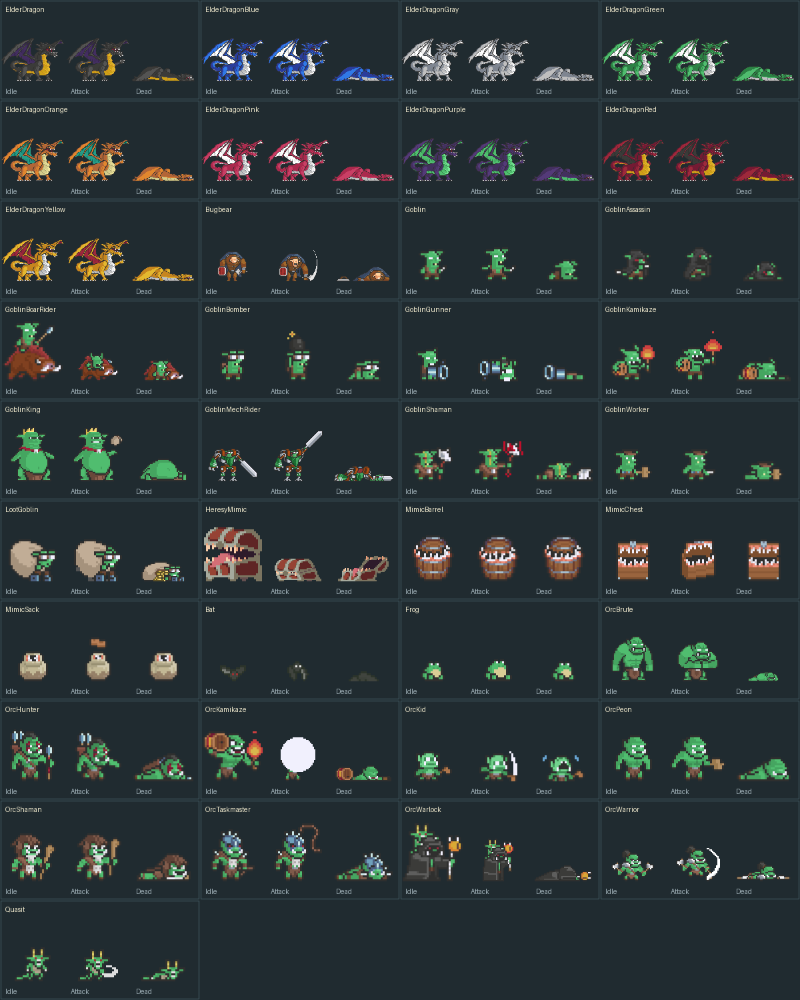

# 몬스터 카탈로그

이름은 프리팹 파일명입니다. 색상 변형 9종을 포함해 37개가 준비되어 있습니다. 실제 등록은 후속 작업입니다.

[몬스터 크기 기준·41종 정밀 검수](MONSTER_SIZES.md) · [실제 배율 비교](Previews/monster-size-comparison.png). 신규 37종과 기존 Bandit 4종의 몸체·배율을 검사했습니다. 아래 원본 동작 도감은 개별 그림을 확대하므로 크기 비교에는 사용하지 않습니다.

| 분류 | 프리팹 | 준비한 기본 동작 | 제약 |
|---|---|---|---|
| Dragons | [ElderDragonBlue](<../../Assets/_Project/Prefabs/Monster/Dragons/ElderDragonBlue.prefab>) | Idle · Walk · Attack · Hurt · Dead | 원본 Idle/Walk/Attack/Hurt/Dead 제공 |
| Dragons | [ElderDragonGray](<../../Assets/_Project/Prefabs/Monster/Dragons/ElderDragonGray.prefab>) | Idle · Walk · Attack · Hurt · Dead | 원본 Idle/Walk/Attack/Hurt/Dead 제공 |
| Dragons | [ElderDragonGreen](<../../Assets/_Project/Prefabs/Monster/Dragons/ElderDragonGreen.prefab>) | Idle · Walk · Attack · Hurt · Dead | 원본 Idle/Walk/Attack/Hurt/Dead 제공 |
| Dragons | [ElderDragonOrange](<../../Assets/_Project/Prefabs/Monster/Dragons/ElderDragonOrange.prefab>) | Idle · Walk · Attack · Hurt · Dead | 원본 Idle/Walk/Attack/Hurt/Dead 제공 |
| Dragons | [ElderDragonPink](<../../Assets/_Project/Prefabs/Monster/Dragons/ElderDragonPink.prefab>) | Idle · Walk · Attack · Hurt · Dead | 원본 Idle/Walk/Attack/Hurt/Dead 제공 |
| Dragons | [ElderDragonPurple](<../../Assets/_Project/Prefabs/Monster/Dragons/ElderDragonPurple.prefab>) | Idle · Walk · Attack · Hurt · Dead | 원본 Idle/Walk/Attack/Hurt/Dead 제공 |
| Dragons | [ElderDragonRed](<../../Assets/_Project/Prefabs/Monster/Dragons/ElderDragonRed.prefab>) | Idle · Walk · Attack · Hurt · Dead | 원본 Idle/Walk/Attack/Hurt/Dead 제공 |
| Dragons | [ElderDragon](<../../Assets/_Project/Prefabs/Monster/Dragons/ElderDragon.prefab>) | Idle · Walk · Attack · Hurt · Dead | 원본 Idle/Walk/Attack/Hurt/Dead 제공 |
| Dragons | [ElderDragonYellow](<../../Assets/_Project/Prefabs/Monster/Dragons/ElderDragonYellow.prefab>) | Idle · Walk · Attack · Hurt · Dead | 원본 Idle/Walk/Attack/Hurt/Dead 제공 |
| Mimics | [MimicChest](<../../Assets/_Project/Prefabs/Monster/Mimics/MimicChest.prefab>) | Idle · Walk · Attack · Hurt · Dead | Source pack has no dedicated Hurt/Dead rows; prepared Hurt uses one idle pose, Dead closes the container (reverse Reveal; Sack settles to idle). No new behavior is implemented. |
| Mimics | [MimicSack](<../../Assets/_Project/Prefabs/Monster/Mimics/MimicSack.prefab>) | Idle · Walk · Attack · Hurt · Dead | Source pack has no dedicated Hurt/Dead rows; prepared Hurt uses one idle pose, Dead closes the container (reverse Reveal; Sack settles to idle). No new behavior is implemented. |
| Mimics | [MimicBarrel](<../../Assets/_Project/Prefabs/Monster/Mimics/MimicBarrel.prefab>) | Idle · Walk · Attack · Hurt · Dead | Source pack has no dedicated Hurt/Dead rows; prepared Hurt uses one idle pose, Dead closes the container (reverse Reveal; Sack settles to idle). No new behavior is implemented. |
| Goblins | [Bugbear](<../../Assets/_Project/Prefabs/Monster/Goblins/Bugbear.prefab>) | Idle · Walk · Attack · Hurt · Dead | 원본 Idle/Walk/Attack/Hurt/Dead 제공 |
| Goblins | [GoblinAssassin](<../../Assets/_Project/Prefabs/Monster/Goblins/GoblinAssassin.prefab>) | Idle · Walk · Attack · Hurt · Dead | 원본 Idle/Walk/Attack/Hurt/Dead 제공 |
| Goblins | [GoblinBoarRider](<../../Assets/_Project/Prefabs/Monster/Goblins/GoblinBoarRider.prefab>) | Idle · Walk · Attack · Hurt · Dead | 원본 Idle/Walk/Attack/Hurt/Dead 제공 |
| Goblins | [GoblinBomber](<../../Assets/_Project/Prefabs/Monster/Goblins/GoblinBomber.prefab>) | Idle · Walk · Attack · Hurt · Dead | 원본 Idle/Walk/Attack/Hurt/Dead 제공 |
| Goblins | [GoblinGunner](<../../Assets/_Project/Prefabs/Monster/Goblins/GoblinGunner.prefab>) | Idle · Walk · Attack · Hurt · Dead | 원본 Idle/Walk/Attack/Hurt/Dead 제공 |
| Goblins | [GoblinKamikaze](<../../Assets/_Project/Prefabs/Monster/Goblins/GoblinKamikaze.prefab>) | Idle · Walk · Attack · Hurt · Dead | 원본 Idle/Walk/Attack/Hurt/Dead 제공 |
| Goblins | [GoblinKing](<../../Assets/_Project/Prefabs/Monster/Goblins/GoblinKing.prefab>) | Idle · Walk · Attack · Hurt · Dead | 원본 Idle/Walk/Attack/Hurt/Dead 제공 |
| Goblins | [GoblinMechRider](<../../Assets/_Project/Prefabs/Monster/Goblins/GoblinMechRider.prefab>) | Idle · Walk · Attack · Hurt · Dead | 원본 Idle/Walk/Attack/Hurt/Dead 제공 |
| Goblins | [GoblinShaman](<../../Assets/_Project/Prefabs/Monster/Goblins/GoblinShaman.prefab>) | Idle · Walk · Attack · Hurt · Dead | 원본 Idle/Walk/Attack/Hurt/Dead 제공 |
| Goblins | [Goblin](<../../Assets/_Project/Prefabs/Monster/Goblins/Goblin.prefab>) | Idle · Walk · Attack · Hurt · Dead | 원본 Idle/Walk/Attack/Hurt/Dead 제공 |
| Goblins | [GoblinWorker](<../../Assets/_Project/Prefabs/Monster/Goblins/GoblinWorker.prefab>) | Idle · Walk · Attack · Hurt · Dead | 원본 Idle/Walk/Attack/Hurt/Dead 제공 |
| Goblins | [LootGoblin](<../../Assets/_Project/Prefabs/Monster/Goblins/LootGoblin.prefab>) | Idle · Walk · Attack · Hurt · Dead | Attack source absent; visual fallback Walk (content-specific behavior remains future work) |
| Orcs | [OrcBrute](<../../Assets/_Project/Prefabs/Monster/Orcs/OrcBrute.prefab>) | Idle · Walk · Attack · Hurt · Dead | 원본 Idle/Walk/Attack/Hurt/Dead 제공 |
| Orcs | [OrcHunter](<../../Assets/_Project/Prefabs/Monster/Orcs/OrcHunter.prefab>) | Idle · Walk · Attack · Hurt · Dead | 원본 Idle/Walk/Attack/Hurt/Dead 제공 |
| Orcs | [OrcKamikaze](<../../Assets/_Project/Prefabs/Monster/Orcs/OrcKamikaze.prefab>) | Idle · Walk · Attack · Hurt · Dead | 원본 Idle/Walk/Attack/Hurt/Dead 제공 |
| Orcs | [OrcKid](<../../Assets/_Project/Prefabs/Monster/Orcs/OrcKid.prefab>) | Idle · Walk · Attack · Hurt · Dead | Hurt source absent; visual fallback Cry (content-specific behavior remains future work); Dead source absent; visual fallback Cry (content-specific behavior remains future work) |
| Orcs | [OrcShaman](<../../Assets/_Project/Prefabs/Monster/Orcs/OrcShaman.prefab>) | Idle · Walk · Attack · Hurt · Dead | 원본 Idle/Walk/Attack/Hurt/Dead 제공 |
| Orcs | [OrcTaskmaster](<../../Assets/_Project/Prefabs/Monster/Orcs/OrcTaskmaster.prefab>) | Idle · Walk · Attack · Hurt · Dead | 원본 Idle/Walk/Attack/Hurt/Dead 제공 |
| Orcs | [Bat](<../../Assets/_Project/Prefabs/Monster/Orcs/Bat.prefab>) | Idle · Walk · Attack · Hurt · Dead | Attack source absent; visual fallback Walk (content-specific behavior remains future work); Hurt source absent; visual fallback Idle (content-specific behavior remains future work); Dead source absent; visual fallback Transform (content-specific behavior remains future work) |
| Orcs | [Frog](<../../Assets/_Project/Prefabs/Monster/Orcs/Frog.prefab>) | Idle · Walk · Attack · Hurt · Dead | Attack source absent; visual fallback Walk (content-specific behavior remains future work); Hurt source absent; visual fallback Idle (content-specific behavior remains future work); Dead source absent; visual fallback Transform (content-specific behavior remains future work) |
| Orcs | [OrcWarlock](<../../Assets/_Project/Prefabs/Monster/Orcs/OrcWarlock.prefab>) | Idle · Walk · Attack · Hurt · Dead | 원본 Idle/Walk/Attack/Hurt/Dead 제공 |
| Orcs | [Quasit](<../../Assets/_Project/Prefabs/Monster/Orcs/Quasit.prefab>) | Idle · Walk · Attack · Hurt · Dead | 원본 Idle/Walk/Attack/Hurt/Dead 제공 |
| Orcs | [OrcWarrior](<../../Assets/_Project/Prefabs/Monster/Orcs/OrcWarrior.prefab>) | Idle · Walk · Attack · Hurt · Dead | 원본 Idle/Walk/Attack/Hurt/Dead 제공 |
| Orcs | [OrcPeon](<../../Assets/_Project/Prefabs/Monster/Orcs/OrcPeon.prefab>) | Idle · Walk · Attack · Hurt · Dead | 원본 Idle/Walk/Attack/Hurt/Dead 제공 |
| Mimics | [HeresyMimic](<../../Assets/_Project/Prefabs/Monster/Mimics/HeresyMimic.prefab>) | Idle · Walk · Attack · Hurt · Dead | 원본 Idle/Walk/Attack/Hurt/Dead 제공 |

## 스테이지 구성 초안

| 스테이지 | 일반 4종 | 보스 1종 | 판단 |
|---|---|---|---|
| 1 — 정비된 숲길 | 기존 Bandit 로스터 유지 | 기존 보스 유지 | 이번 작업에서 등록 변경 없음 |
| 2 — 풀숲길 | Goblin, GoblinAssassin, GoblinBomber, GoblinShaman | GoblinKing | 작은 실루엣·녹색 피부·숲 계열. 왕관과 체격으로 보스 구분 |
| 3 — 깊은 숲 | OrcWarrior, OrcHunter, OrcShaman, OrcTaskmaster | OrcBrute | 고블린보다 큰 체격·무기·주술, 근육형 대형 보스 |

Bugbear·BoarRider는 숲의 변주/정예 후보, Gunner·MechRider·Kamikaze는 테마를 확장하는 특수 콘텐츠 후보입니다. LootGoblin은 보상 이벤트, 미믹은 보물/던전, 드래곤은 별도 대형 보스 콘텐츠, Quasit/Bat/Frog는 변신·소환 콘텐츠에 적합합니다. 새 기능이나 스탯을 정의한 분류는 아닙니다.

## 원본 결손과 시각 대체

- LootGoblin, Bat, Frog: 독립 공격 원본이 없어 정지 자세로 기본 Attack 인터페이스를 채웠습니다. 공격 콘텐츠로 채택할 때 별도 연출을 결정해야 합니다.
- OrcKid: Hurt/Dead 전용 원본이 없어 울음 자세의 정지 프레임을 사용합니다. 사망 그림이 새로 제작된 것은 아닙니다.
- 상자·통 미믹: Hurt는 정지 자세, Dead는 등장 동작을 뒤집어 닫는 방식입니다. 자루 미믹은 정지 자세로 정리됩니다.
- GoblinGunner: Attack + Recover를 기존 반복 공격 인터페이스에 맞는 AttackCycle로 연결했습니다.
- 일반 병과·Bandit 본체 프리팹은 기존 것을 재사용합니다. Bandit 4종의 표시 배율은 후속 크기 검수에서 보정했습니다. 추가 시트는 해당 병과의 Prepared 클립을 통해 선택 적용합니다.

아래 이미지는 원본 시트의 Idle·Attack·Dead 후보 프레임을 비교한 도감입니다. 상기 대체 클립의 최종 모습은 `Manifests/monsters.json`의 실제 컨트롤러 연결을 기준으로 확인하세요.

