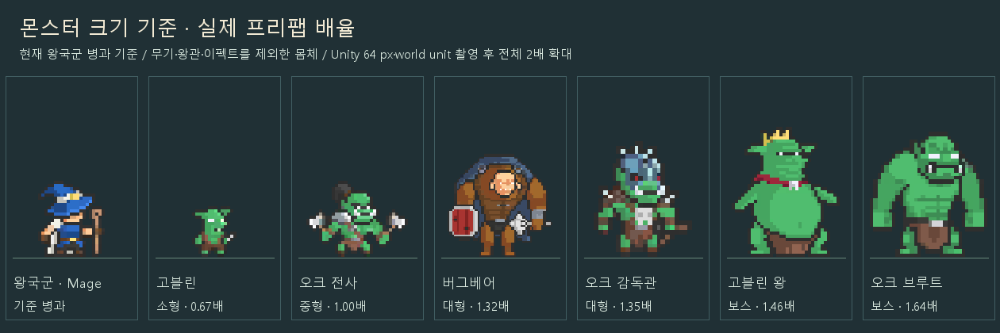
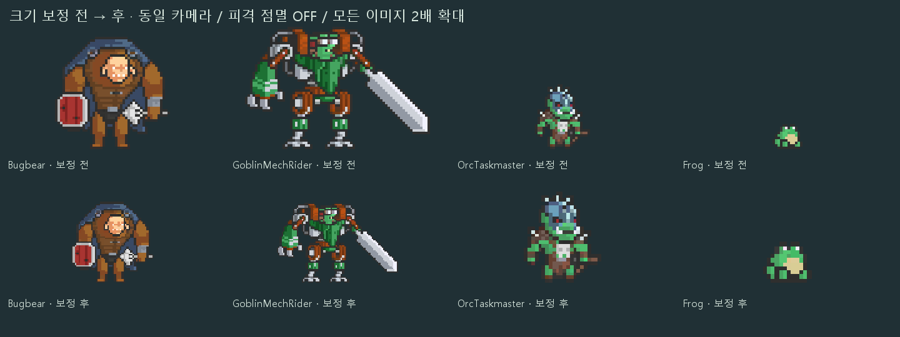
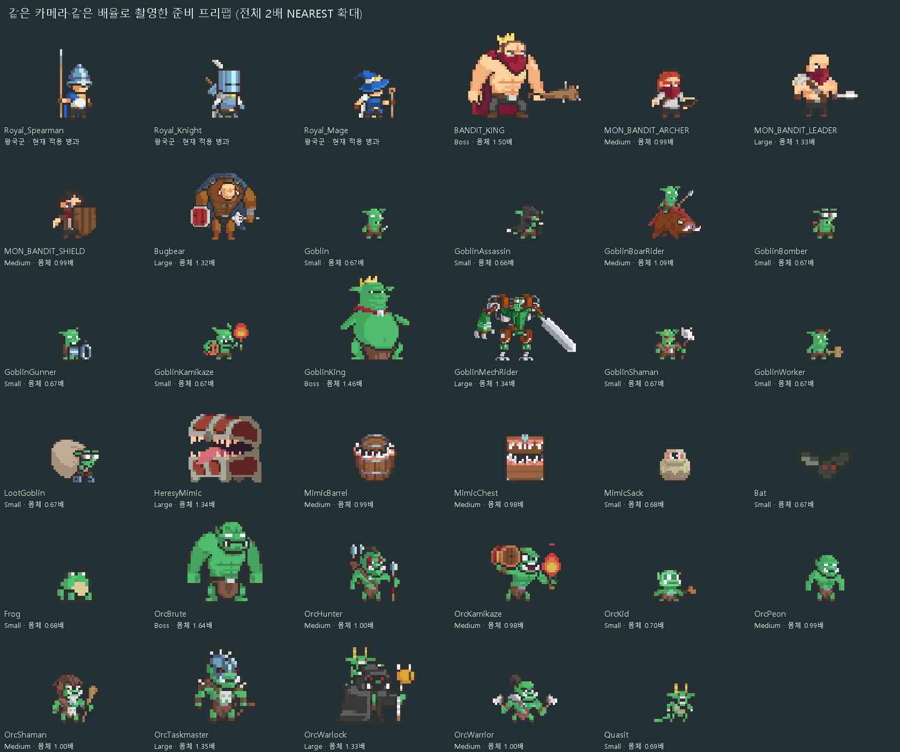
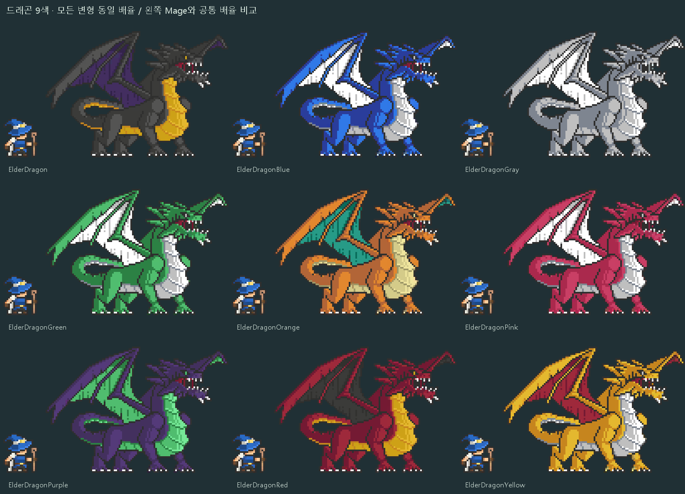

# 몬스터 크기 검수 — 2026-09-15

[전체 카탈로그](MONSTERS.md) · [정밀 측정 데이터](Manifests/monster-sizes.json) · [검증 결과](Manifests/size-forest-verification.json)

## 실제 표시 기준

현재 `JobDatabase`의 7개 왕국군 병과와 준비 몬스터를 비교했습니다. 몸체 기준값은 32 PPU에서 24픽셀, 즉 0.75 world unit입니다. 병과의 모자·투구·창 때문에 전체 실루엣 높이는 다릅니다. 기존 Lancer 프리팹의 초기 16 PPU 스프라이트는 병과 적용 후 사용하는 32 PPU 아트와 다르므로 기준에서 제외했습니다. 기존 프리뷰의 고블린이 지나치게 작아 보이던 주요 원인입니다.

기본 고블린은 원래 16픽셀 몸체로 기준의 2/3입니다. 기본 배율을 유지하고, 웅크린 Assassin과 다른 종족의 작은 소환물은 식별 가능한 체격으로 보정했습니다. 무기·폭발·등짐·왕관은 몸체 측정에서 제외했습니다. 박쥐는 비행 실루엣, 멧돼지 탑승병은 탑승물 포함 높이를 사용한 예외입니다.

## 조정 결과

| 분류 | 수 | 몸체 / 기준 왕국군 |
|---|---:|---:|
| 소형 | 13 | 0.664–0.703 |
| 중형 | 10 | 0.984–1.094 |
| 대형 | 6 | 1.318–1.348 |
| 보스 | 12 | 1.458–2.833, 콘셉트별 |

신규 37종과 기존 Bandit 4종을 검사하고 프리팹에 배율을 저장했습니다. TinyRPG 6개와 왕국군·스테이지 등록은 유지했습니다. 모든 드래곤 색상은 동일한 배율입니다. 숫자는 외형 분류이며 능력치나 난이도 변경이 아닙니다.

## 프리팹별 측정

| 프리팹 | 분류 | 몸체 비율 | 저장 배율 | 역할·판단 |
|---|---|---:|---:|---|
| [BANDIT_KING](<../../Assets/_Project/Prefabs/Monster/BANDIT/BANDIT_KING.prefab>) | Boss | 1.500 | 1.125 | 기존 보스; 왕관·둔기 유지 |
| [MON_BANDIT_ARCHER](<../../Assets/_Project/Prefabs/Monster/BANDIT/MON_BANDIT_ARCHER.prefab>) | Medium | 0.990 | 1.1875 | 기존 원거리 |
| [MON_BANDIT_LEADER](<../../Assets/_Project/Prefabs/Monster/BANDIT/MON_BANDIT_LEADER.prefab>) | Large | 1.333 | 1.3333 | 기존 지휘 정예 |
| [MON_BANDIT_SHIELD](<../../Assets/_Project/Prefabs/Monster/BANDIT/MON_BANDIT_SHIELD.prefab>) | Medium | 0.990 | 1.1875 | 기존 방패 근접 |
| [ElderDragon](<../../Assets/_Project/Prefabs/Monster/Dragons/ElderDragon.prefab>) | Boss | 2.833 | 1 | 대형 보스 콘텐츠; 날개·꼬리 포함 범위 별도 검수, 모든 색상 동일 배율 |
| [ElderDragonBlue](<../../Assets/_Project/Prefabs/Monster/Dragons/ElderDragonBlue.prefab>) | Boss | 2.833 | 1 | 대형 보스 콘텐츠; 날개·꼬리 포함 범위 별도 검수, 모든 색상 동일 배율 |
| [ElderDragonGray](<../../Assets/_Project/Prefabs/Monster/Dragons/ElderDragonGray.prefab>) | Boss | 2.833 | 1 | 대형 보스 콘텐츠; 날개·꼬리 포함 범위 별도 검수, 모든 색상 동일 배율 |
| [ElderDragonGreen](<../../Assets/_Project/Prefabs/Monster/Dragons/ElderDragonGreen.prefab>) | Boss | 2.833 | 1 | 대형 보스 콘텐츠; 날개·꼬리 포함 범위 별도 검수, 모든 색상 동일 배율 |
| [ElderDragonOrange](<../../Assets/_Project/Prefabs/Monster/Dragons/ElderDragonOrange.prefab>) | Boss | 2.833 | 1 | 대형 보스 콘텐츠; 날개·꼬리 포함 범위 별도 검수, 모든 색상 동일 배율 |
| [ElderDragonPink](<../../Assets/_Project/Prefabs/Monster/Dragons/ElderDragonPink.prefab>) | Boss | 2.833 | 1 | 대형 보스 콘텐츠; 날개·꼬리 포함 범위 별도 검수, 모든 색상 동일 배율 |
| [ElderDragonPurple](<../../Assets/_Project/Prefabs/Monster/Dragons/ElderDragonPurple.prefab>) | Boss | 2.833 | 1 | 대형 보스 콘텐츠; 날개·꼬리 포함 범위 별도 검수, 모든 색상 동일 배율 |
| [ElderDragonRed](<../../Assets/_Project/Prefabs/Monster/Dragons/ElderDragonRed.prefab>) | Boss | 2.833 | 1 | 대형 보스 콘텐츠; 날개·꼬리 포함 범위 별도 검수, 모든 색상 동일 배율 |
| [ElderDragonYellow](<../../Assets/_Project/Prefabs/Monster/Dragons/ElderDragonYellow.prefab>) | Boss | 2.833 | 1 | 대형 보스 콘텐츠; 날개·꼬리 포함 범위 별도 검수, 모든 색상 동일 배율 |
| [Bugbear](<../../Assets/_Project/Prefabs/Monster/Goblins/Bugbear.prefab>) | Large | 1.318 | 0.71875 | 중갑 정예; 두꺼운 체형 유지 |
| [Goblin](<../../Assets/_Project/Prefabs/Monster/Goblins/Goblin.prefab>) | Small | 0.667 | 1 | 일반 근접 |
| [GoblinAssassin](<../../Assets/_Project/Prefabs/Monster/Goblins/GoblinAssassin.prefab>) | Small | 0.664 | 1.0625 | 잠행 근접; 웅크린 자세 유지 |
| [GoblinBoarRider](<../../Assets/_Project/Prefabs/Monster/Goblins/GoblinBoarRider.prefab>) | Medium | 1.094 | 0.875 | 기병; 탑승물 포함 높이를 중형 상단에 배치 |
| [GoblinBomber](<../../Assets/_Project/Prefabs/Monster/Goblins/GoblinBomber.prefab>) | Small | 0.667 | 1 | 투척; 폭탄 궤적은 몸체 측정 제외 |
| [GoblinGunner](<../../Assets/_Project/Prefabs/Monster/Goblins/GoblinGunner.prefab>) | Small | 0.667 | 1 | 원거리; 고글·총기 유지 |
| [GoblinKamikaze](<../../Assets/_Project/Prefabs/Monster/Goblins/GoblinKamikaze.prefab>) | Small | 0.667 | 1 | 폭발; 배낭·불꽃은 몸체 측정 제외 |
| [GoblinKing](<../../Assets/_Project/Prefabs/Monster/Goblins/GoblinKing.prefab>) | Boss | 1.458 | 1 | 2스테이지 보스 후보; 큰 배·왕관 유지 |
| [GoblinMechRider](<../../Assets/_Project/Prefabs/Monster/Goblins/GoblinMechRider.prefab>) | Large | 1.340 | 0.65625 | 기계 탑승 정예; 검격 VFX는 크기 기준 제외 |
| [GoblinShaman](<../../Assets/_Project/Prefabs/Monster/Goblins/GoblinShaman.prefab>) | Small | 0.667 | 1 | 지원 주술사; 지팡이 유지 |
| [GoblinWorker](<../../Assets/_Project/Prefabs/Monster/Goblins/GoblinWorker.prefab>) | Small | 0.667 | 1 | 작업/보조 |
| [LootGoblin](<../../Assets/_Project/Prefabs/Monster/Goblins/LootGoblin.prefab>) | Small | 0.667 | 1 | 보상 이벤트; 큰 자루 유지 |
| [HeresyMimic](<../../Assets/_Project/Prefabs/Monster/Mimics/HeresyMimic.prefab>) | Large | 1.336 | 1.1875 | 특수 보물 정예 |
| [MimicBarrel](<../../Assets/_Project/Prefabs/Monster/Mimics/MimicBarrel.prefab>) | Medium | 0.988 | 1.0312 | 보물 위장; 통 용적 유지 |
| [MimicChest](<../../Assets/_Project/Prefabs/Monster/Mimics/MimicChest.prefab>) | Medium | 0.984 | 1.125 | 보물 위장; 상자 용적 유지 |
| [MimicSack](<../../Assets/_Project/Prefabs/Monster/Mimics/MimicSack.prefab>) | Small | 0.684 | 1.0938 | 작은 보상 위장; 투척 내용물은 몸체 측정 제외 |
| [Bat](<../../Assets/_Project/Prefabs/Monster/Orcs/Bat.prefab>) | Small | 0.667 | 2 | 비행/변신; 날개를 포함한 식별 실루엣 기준 예외 |
| [Frog](<../../Assets/_Project/Prefabs/Monster/Orcs/Frog.prefab>) | Small | 0.677 | 1.625 | 변신; 낮고 넓은 실루엣, 눈과 몸통 가독성 우선 |
| [OrcBrute](<../../Assets/_Project/Prefabs/Monster/Orcs/OrcBrute.prefab>) | Boss | 1.638 | 1.1562 | 3스테이지 보스 후보; 근육형, 팔 들기 동작 별도 검수 |
| [OrcHunter](<../../Assets/_Project/Prefabs/Monster/Orcs/OrcHunter.prefab>) | Medium | 1.003 | 1.0938 | 원거리; 등에 멘 무기는 몸체 측정 제외 |
| [OrcKamikaze](<../../Assets/_Project/Prefabs/Monster/Orcs/OrcKamikaze.prefab>) | Medium | 0.984 | 1.125 | 폭발; 폭발 프레임 확대를 체격으로 오인하지 않음 |
| [OrcKid](<../../Assets/_Project/Prefabs/Monster/Orcs/OrcKid.prefab>) | Small | 0.703 | 1.125 | 보조/비전투 콘텐츠 후보 |
| [OrcPeon](<../../Assets/_Project/Prefabs/Monster/Orcs/OrcPeon.prefab>) | Medium | 0.988 | 1.0312 | 노동/근접 |
| [OrcShaman](<../../Assets/_Project/Prefabs/Monster/Orcs/OrcShaman.prefab>) | Medium | 1.000 | 1 | 지원 주술사 |
| [OrcTaskmaster](<../../Assets/_Project/Prefabs/Monster/Orcs/OrcTaskmaster.prefab>) | Large | 1.348 | 1.4062 | 지휘 정예; 장식 투구와 채찍 유지 |
| [OrcWarlock](<../../Assets/_Project/Prefabs/Monster/Orcs/OrcWarlock.prefab>) | Large | 1.335 | 1.2812 | 정예 주술사; 왕관·지팡이 유지 |
| [OrcWarrior](<../../Assets/_Project/Prefabs/Monster/Orcs/OrcWarrior.prefab>) | Medium | 1.000 | 1 | 일반 근접 |
| [Quasit](<../../Assets/_Project/Prefabs/Monster/Orcs/Quasit.prefab>) | Small | 0.693 | 1.1875 | 소환/변신; 뿔은 몸체 측정 제외 |

## 검수 방법과 적용 범위

- 원본 픽셀·PPU·애니메이션 클립은 유지했습니다. Unity가 로드한 스프라이트 사각 영역과 원본 PNG의 불투명 픽셀, 눈으로 확인한 몸체 범위를 함께 사용했습니다. 측정한 프레임·몸체 사각 영역·배율은 JSON에 기록했습니다.
- 새 37개 프리팹은 Visual 자식의 배율·몸체 중심·발 위치와 원형 트리거를 맞췄습니다. Bandit 4개는 기존 피벗 구조를 유지하고 표시 배율을 변경했습니다. BanditKing은 루트 배율이므로 기존 충돌체에도 같은 배율이 적용됩니다.
- 원래 공용 머티리얼의 `_FlashAmount=0.446` 때문에 초기 에디터 표시가 희게 뜨는 것을 확인했습니다. 같은 셰이더를 사용하는 `Art/Materials/Monsters/MonsterHitFlash.mat` 작업본의 기본값을 0으로 준비해 41종이 공유합니다. 기존 피격 스크립트와 호환됩니다. 원래 머티리얼과 TinyRPG는 보존했습니다.
- 프리팹을 실제로 인스턴스화하고 클립을 샘플링했습니다. 1,446개 스프라이트 키에서 크기·피벗 유지, 스프라이트 참조, 충돌체·머티리얼 검사를 통과했습니다. 정지·공격·사망 130장과 환경 문맥 90장을 촬영했습니다. 피격 점멸은 기존 OnAlloc의 ResetFlash와 같은 0 상태로 촬영했습니다.
- 비교 도감은 공통 64 pixels/world unit 카메라 결과 전체를 정수 2배 NEAREST로 확대했습니다. 개별 몬스터마다 캔버스를 채우도록 재확대하지 않았습니다. 환경 캡처는 360×800·540×960·720×960 원본 크기입니다.
- 현재 HP바 코드는 `Renderer.bounds`를 사용합니다. 그 값에는 시트의 투명 여백·무기·공격 VFX가 포함됩니다. 측정 JSON의 `bodyHeightWU`·`visualPosition`은 후속 통합에서 머리 위 UI 기준을 연결할 수 있도록 따로 기록했습니다. 이번에는 HP바 코드나 카메라·스포너를 변경하지 않았습니다.
- 실제 기기 재검증은 앞선 Android 서명 실패로 수행하지 못했습니다. 씬·전투 등록을 연결한 최종 플레이 화면이나 기기 성능 검증으로 간주하지 않습니다.

