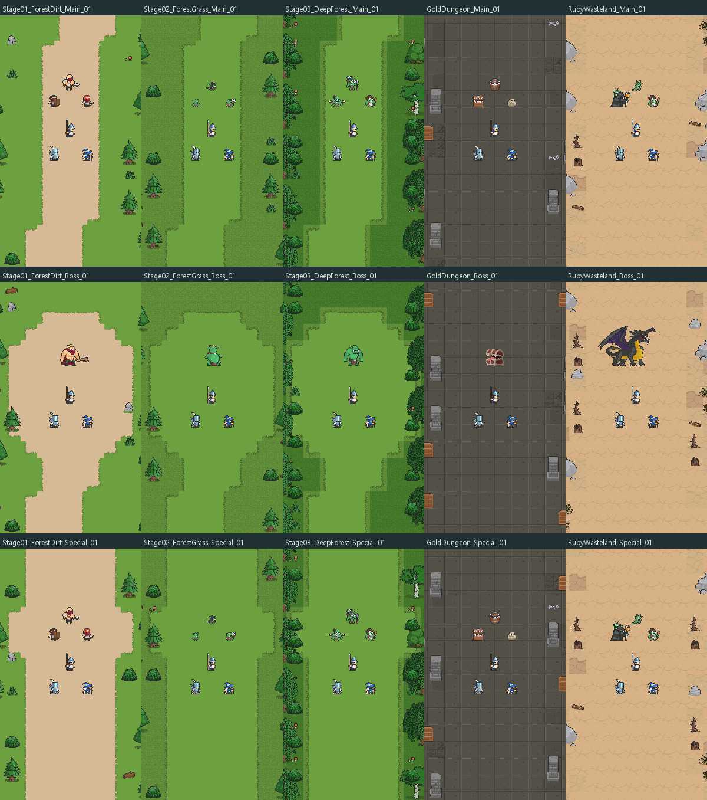

# 아트 정리·인게임 적용 준비 — 2026-09-15

[프로젝트 아트 폴더 안내](../../Assets/_Project/Art/README.md) · [몬스터 카탈로그](MONSTERS.md) · [환경 90개 목록](ENVIRONMENTS.md) · [후속 연결 안내](INTEGRATION.md) · [검증 기록](VALIDATION.md)

후속 요청 반영: [몬스터 41종 크기 검수](MONSTER_SIZES.md) · [실제 크기 비교](Previews/monster-size-comparison.png) · [2·3스테이지 숲 비교](Previews/stage2-stage3-comparison.png)

## 준비 결과

| 항목 | 결과 |
|---|---:|
| 주요 번들 원본 파일 대응 | 138 / 138 |
| 새 작업본 복사 | 119 |
| 이미 있는 작업본 재사용 | 19 |
| 기존 파일 분류 이동 | 628, 원래 GUID 유지 |
| 신규 몬스터 본체 프리팹 | 37 |
| 투사체·효과·토템·환경 애니메이션 프리팹 | 54 |
| 환경 프리셋 | 90: 5개 풀 × 일반 10 + 보스 3 + 특수 5 |
| 준비 폴더의 애니메이션 클립 | 549 |
| 공유 타일·환경 오브젝트 Tile 에셋 | 965 |
| 콘텐츠별 준비 아틀라스 | 51 |
| 정리한 빈 폴더 / 잔여 클립 | 189 / 5, 로컬 복구 보관 |

왕국군 스프라이트는 16개 병과·용도 폴더로 정리했습니다. 스크립트 폴더에 있던 PNG, 애니메이션, 컨트롤러, 프리팹은 모두 해당 아트/프리팹 폴더로 옮겼습니다. 장비 시트 6개는 폴더 GUID까지 유지해 기존 아틀라스 연결을 보존했습니다.

외부 원본 파일과 메타데이터의 SHA-256은 작업 전과 같습니다. 모든 번들 파일은 원본과 동일한 바이트의 작업본으로 대응됩니다. 기존 씬, C# 파일, 스테이지 설정, Addressables 등록은 변경하지 않았습니다.

## 사용 범위

준비 프리팹은 현재 씬이나 스테이지에 배치하지 않았습니다. 몬스터의 기존 5개 상태 인터페이스, 시각 애니메이션, 타일맵 배치를 준비한 상태입니다. 능력치·스킬·스폰·비행·피해 판정·배경 무작위 선택은 후속 통합 범위입니다. 원본에 없는 행동은 [몬스터 카탈로그](MONSTERS.md)에 대체 방법을 명시했습니다.

기존 궁수 컨트롤러의 끊어진 `Charge_Shot_Anim` 참조 1건은 원본 궁수 시트 8프레임으로 복구했습니다. 기존 캐릭터와 장비의 아틀라스 입력을 유지하고, 작업본의 중복 압축도 해소했습니다.

## 미리보기

아래 이미지는 Unity의 임시 PreviewScene에서 렌더링했습니다. 현재 병과의 Spearman·Knight·Mage와 각 환경의 검수용 몬스터를 실제 프리팹 배율로 배치했습니다. 새로운 스테이지가 실제 게임에 적용된 화면은 아닙니다. 3스테이지 18종 전체와 다른 풀의 대표 12종을 360×800, 540×960, 720×960으로 총 90회 캡처했습니다.

초기 이미지의 큰 Lancer는 현재 병과와 PPU가 달라 크기 기준이 잘못되어 있었습니다. 기존 공개 미리보기는 올바른 병과·배율로 교체했습니다. 3스테이지는 수관·관목을 늘려 울창하게 정리했고, 몬스터 41종(기존 Bandit 4종 포함)의 표시 크기를 프리팹에 저장했습니다. TinyRPG 교체와 배경 무작위 선택은 연결하지 않았습니다.

## 출처·검증 데이터

- [복사·재사용·이동 대응표](Manifests/source-map-and-moves.json)
- [스프라이트 분할·원본 프레임 시간](Manifests/source-animations.json)
- [몬스터 실제 컨트롤러 클립·길이](Manifests/monsters.json)
- [효과·투사체·환경 애니메이션](Manifests/visual-effects.json)
- [환경 구도·중앙 여백·시드](Manifests/environment-presets.json)
- [아틀라스 입력](Manifests/atlas-inputs.json) 및 [페이지 측정](Manifests/atlas-pages.json)
- [원본 보존·파일 무결성](Manifests/verification.json)
- [정리 항목의 로컬 복구 위치](Manifests/cleanup.json)

공급자의 Aseprite JSON이 있으면 원본 사각 영역과 프레임 시간을 사용했습니다. JSON이 없는 시트는 원본 그림을 검수해 고정 격자로 분할하고 기본 100ms/frame을 사용했습니다. 픽셀을 생성하거나 다시 그리지 않았고 외부 유료 생성 서비스 사용은 없습니다.
