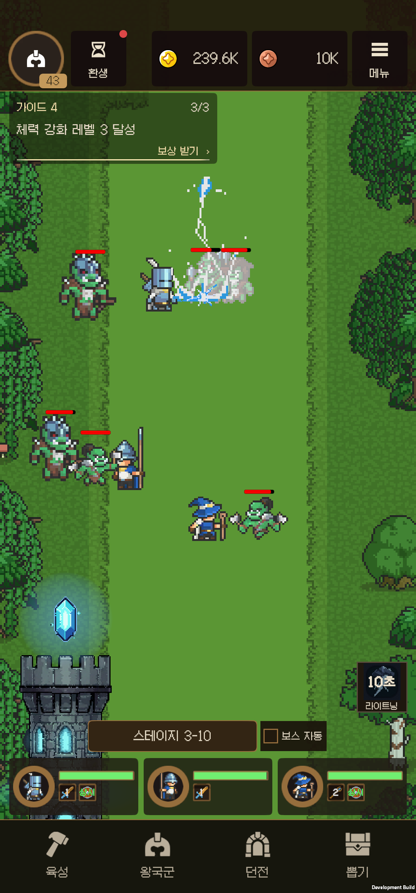
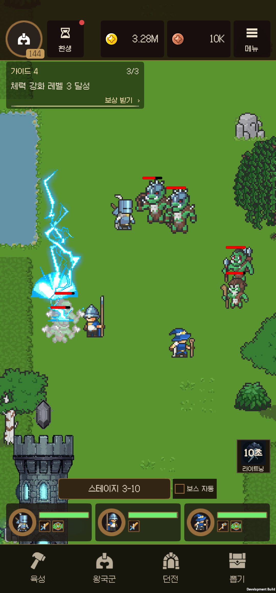
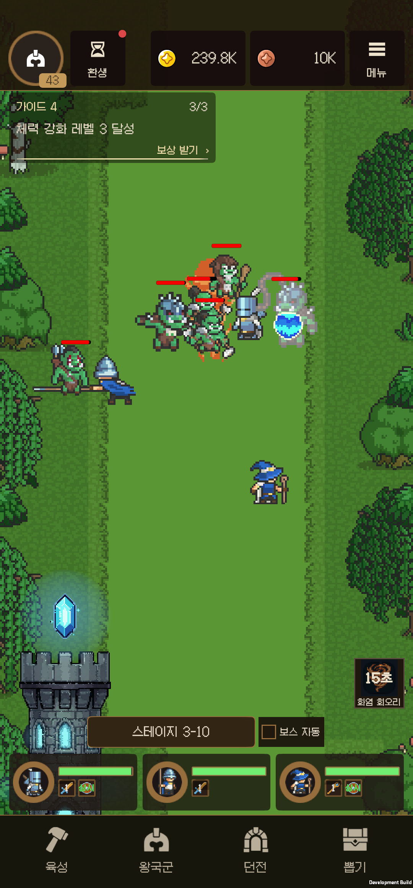
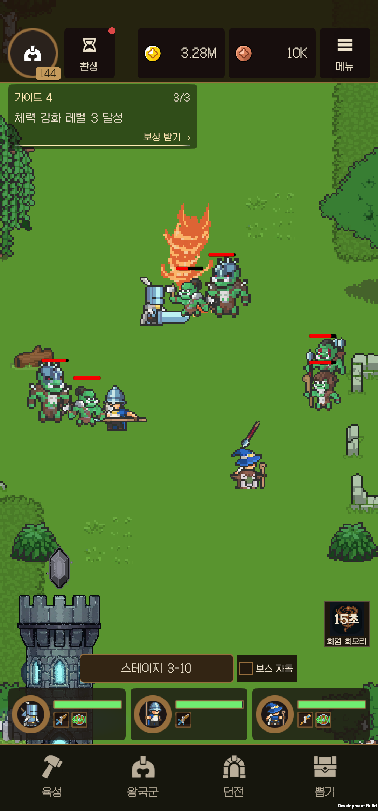
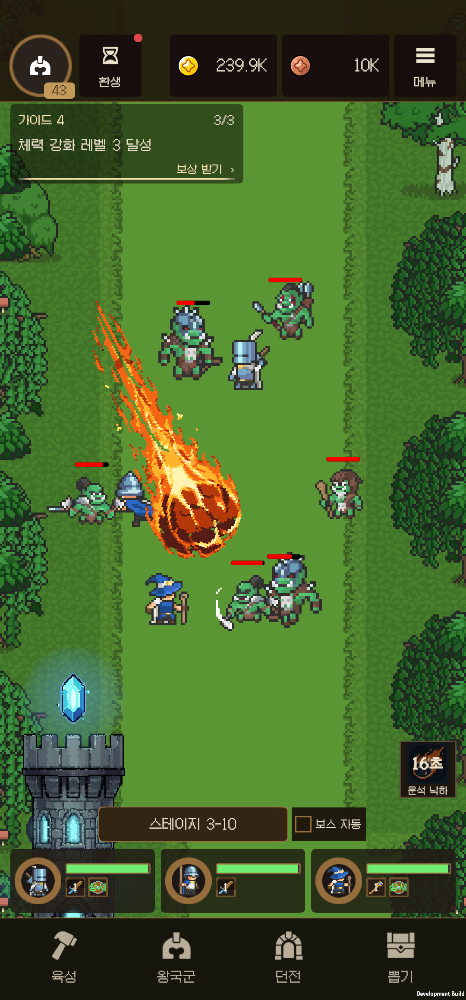
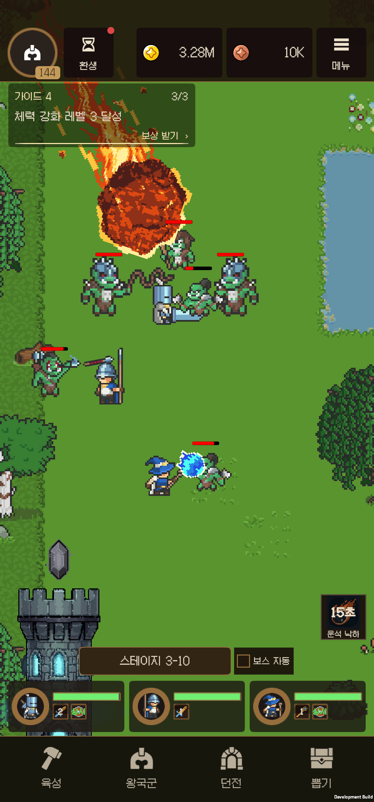
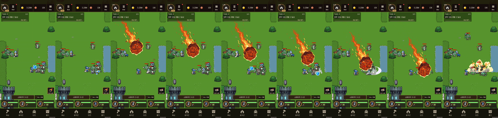

# 스킬 애니메이션 후속 개정

대상은 화염폭풍 상단, 일반 라이트닝 복원, 운석 낙하 연출이다. 시작점 `53a31a65c`는 이미 커밋된 상태였으며, 구현 중간에 `6e126fd15`로 저장했다. 기존 다른 팀원의 전투·UI 변경과 ExternalAssets 원본은 보존했다.

## 변경과 판단

| 대상 | 원인 / 이전 상태 | 적용 |
|---|---|---|
| 화염폭풍 | 원본에는 상단 투명 여백이 있지만 평평한 불꽃 꼭대기가 잘린 것처럼 보임 | 원래 몸통 6개 포즈 유지, 꼭대기만 굴곡·불꽃 혀 추가. 64×80 캔버스의 12프레임, 24fps. 프레임 테두리의 불투명 픽셀 0 |
| 일반 라이트닝 | 기존 최초 cyan ThunderEffects가 작은 흰색 번개와 별도 폭발로 교체됨 | 최초 원화 5프레임·12fps 그대로 복원. 원래 크기와 타격 이벤트 시점 2/12초, 첫 타격 이후 중심 반경 0.8 분산 복원 |
| 각성 낙뢰 | 원형과 같은 연결 패턴 요구 | 기본 3회 / A4 4회 / A8~10 5회. 개별 반경 0.55, 조준 표시 전체 범위 1.35. 천벌 개화는 원화·동작 유지 |
| 운석 | 8프레임에서 본체는 거의 정지, 0.8초 낙하 | 48프레임·20fps·2.4초 낙하. 두 축으로 회전하는 암석 균열, 진행 방향 반대쪽으로 흐르는 불꽃, 불티와 파편, 앞쪽의 뜨거운 테두리. 충돌 위치·잔열 2회 유지 |

운석 첫 가공 시안은 불꽃이 덩어리로 뭉치고 몸체가 너무 어두워 기각했다. 채택본은 이전 Comfy 마스터의 가는 화염 윤곽을 활용하고 새 표면 마스터만 회전 투영했다. 단순 꼬리 흔들기와 구별되도록 암석 균열이 가장자리 뒤로 사라지고 반대편에서 새 면이 들어온다. 제작 공정·설정·원본·기각본·실제 제출 그래프·비용 조회는 [revision5](../../AI/comfyui/mage-vfx/revision5/README.md)에 있다.

32 PPU, 6색, Point/ASTC 4×4, 불투명 본체, mipmap/readable OFF를 사용한다. 일반 라이트닝은 사용자가 요청한 최초 원화 복원이 우선이므로 원래 중간색과 유효 42.67 PPU를 그대로 유지했다. 운석 시트는 1536×1248(압축 전 7.31 MiB, ASTC 4×4 약 1.83 MiB, 아틀라스 패킹 별도)다. 한 낙하체의 런타임 렌더러 수는 1개로 유지한다.

## Unity 실제 플레이

Unity 6000.3.21f1에서 import·컴파일·프리팹 재생성·아틀라스·직렬화 연결 검사 후 실제 Play Mode를 실행했다. 별도 검증 계정으로 8회 시전했다.

- 일반 라이트닝 A0/A4/A8/A10: 3/4/5/5회. 5개 원본 프레임 모두 재생, 약 0.166667초 간격.
- 천벌: 일반 낙뢰 체인이 섞이지 않으며 약 2.017초에 개화 피해 발생.
- 화염폭풍: 12개 프레임 재생, 피해·종료 확인.
- 운석 2회: 매번 48개 프레임 재생, 첫 피해 약 2.517초. 풀 재사용 후에도 낙하와 충돌 정상.
- 예외·assertion 0건. 첫 검증은 동기 스크린샷 캡처가 게임 프레임을 멈춰 낙뢰 간격 검사에 실패했다. 재검증은 캡처 전용 고정 1/60초 게임 시계를 사용했으며, Android에서는 실제 시간으로 별도 확인한다.

원문: [Play Mode 결과](Validation/SpellAnimation20260920/editor-play.json). [픽셀 검사](Validation/SpellAnimation20260920/pixel-audit.json)와 [본체 움직임 검사](Validation/SpellAnimation20260920/motion-audit.json)에서 운석 몸체 내부의 연속 프레임 변경량은 18.2~23.9%, 몸체 알파는 항상 255이며, 라이트닝 복사본은 최초 원본과 픽셀 단위로 같음을 확인했다. 카탈로그 7개 셀을 업데이트했고 원래 시트·수식·표·고정 창을 보존했다.

## Android 및 최종 기록

SM-N986N 한 대, ARM64 IL2CPP 진단 b54에서 15회 시전했다. 기본 1080×2316 및 같은 기기의 720×1280·1080×2400·1200×1600 해상도 변경이다. 여러 실제 기기를 검증했다는 의미는 아니다.

- 일반 라이트닝 A0/A4/A8/A10의 3/4/5/5회, 실제 간격 약 0.175~0.183초. 최초 원화 사용·전면 레이어·피해·종료 확인.
- 천벌의 일반 체인 미발생, 개화 피해 약 2.014초. 기존 뇌운·낙뢰·충격 연출 유지.
- 화염폭풍은 후면 장판 레이어, 불꽃 꼭대기와 몸통의 연결, 피해·종료 확인.
- 운석 반복 시전 첫 피해 2.505/2.513초, 세 비율에서도 2.505~2.513초. 전면 낙하체와 후면 크레이터 유지.
- 정상 속도 영상을 프레임별로 대조해 몸체 표면 회전, 꼬리의 변형·흐름, 파편, 느린 가속과 착탄을 확인했다. 태블릿의 상단 목표에서는 초반 운석 일부가 상단 가이드/HUD 뒤로 들어오며, 후반 낙하와 착탄은 전장에서 보인다. HUD보다 앞에 그려 조작·안내를 가리지는 않는다.
- 진단 상태의 런타임 오류 0건. [시전 기록](Validation/SpellAnimation20260920/device-casts.json), [화면 비율 기록](Validation/SpellAnimation20260920/aspects.json).

라이트닝·화염폭풍·운석·맹독 늪·공허 균열 5종 자동 편성으로 일반/저사양 각각 30초를 측정했다. 측정 중 명령 폴링·결과 직렬화는 중단했다.

| 측정 | 일반 | 저사양 |
|---|---:|---:|
| 평균 FPS | 59.82 | 59.86 |
| p95 / p99 프레임 ms | 16.67 / 16.72 | 16.67 / 16.70 |
| 최대 프레임 ms | 66.53 | 83.17 |
| 50ms 초과 프레임 | 3 | 1 |
| 평균 드로우콜 | 34.52 | 33.64 |
| CPU 코어 환산 사용률 | 88.65% | 85.48% |
| Unity 메모리 시작 / 끝 | 166.32 / 166.34 MB | 166.67 / 166.66 MB |

[성능 원문](Validation/SpellAnimation20260920/performance.json). 30초 표본이므로 장시간 누수·다른 GPU의 성능까지 보장하지 않는다. 짧은 프레임 지연은 위 표에 그대로 기록했다.

검증 전 앱 저장·설정을 `Original/external.tar`, `Original/internal.tar`로 백업했다. 이후 검증 계정 외 저장 54개 파일이 바이트 단위로 같음을 확인하고, 검증 계정과 설정을 원래 상태로 복원했다. 이번 검사에서 만든 진단 파일 220개만 삭제했다. [복원 결과](Validation/SpellAnimation20260920/restoration.json). 기존 장비창을 다시 비우거나 장비를 분해하지 않았다.

최종 **0.13.1 (b55), 스킬 애니메이션 플레이**를 같은 패키지에 교체 설치했다. 진단 프로브/강제 계정 지정은 제외했으며 Development ARM64 IL2CPP 빌드다. 빌드 오류 0, 기존 SDK obsolete API 등을 포함한 경고 88건이다. 실제 계정 로그인 메뉴에서 게스트 로그인을 선택해 원래 레벨 200 계정으로 들어갔다. 방치 보상 확인, 전투, 마탑 편성 메뉴, 일반 라이트닝의 3→4→5회 각성 설명과 `개화 켜기` 상태, Android 뒤로가기 복귀를 확인했다. 실제 편성은 바꾸지 않고 장착된 운석과 화염폭풍을 터치해 새 연출도 확인했다. 라운드 전환 중 대상이 없는 시도는 쿨다운을 소비하지 않았고 다음 시도는 정상 시전됐다.

기기에 남은 프로젝트 앱은 `com.isolatedyouth.idlekingdomrpg.lobbyqa` 한 개이며, 원래 해상도 설정 1080×2316 / density 450을 보존했다. 실제 전투에 따른 정상 진행·보상은 유지했다. 최종 앱 프로세스 로그에서 예외·ANR·fatal crash 검색 결과는 0건이다. [최종 확인](Validation/SpellAnimation20260920/final-device.json).

Comfy 실제 조회: GPU **2.786269초**, 해당 시간대 청구 기반 추가 지출 **$0.003608218355**. 작업별 달러 금액 API가 아닌 작업공간 시간 버킷의 확인된 증가분이다. [비용 원문](../../AI/comfyui/mage-vfx/revision5/cost-summary.json).

## 전후 캡처

이전 캡처는 앞선 FoundationRevision 기기 검수에서, 이후 캡처는 이번 b54의 실제 전투에서 가져왔다. 시전 지점과 전투 배치는 다르다.

| 스킬 | 이전 | 이후 |
|---|---|---|
| 일반 라이트닝 |  |  |
| 화염폭풍 |  |  |
| 운석 |  |  |

정상 속도 운석 영상의 연속 장면:

## 후속 조정: 운석 낙하 1.5초 (0.13.2)

사용자 피드백에 따라 낙하 시간을 2.4초에서 **1.5초**로 줄였다. 기존 48프레임은 20fps에서 **32fps**로 재생하여 회전·화염 흐름·파편의 전체 동작을 유지한다. 가속 곡선과 경로, 충돌 후 0.09초 피해 지연, 잔열 2회는 그대로다. 런타임과 실제 AnimationClip, 재생성 설정, 운영 카탈로그를 함께 갱신했다. 위 0.13.1 검증과 Comfy 제작 기록은 당시 결과로 보존한다.

Unity 6000.3.21f1의 운석 전용 Play Mode 검증에서 반복 시전 2회 모두 48프레임을 재생했으며 첫 피해는 약 1.617초였다. 이는 낙하 후 피해 지연과 프레임 단위 진행을 포함한 측정값이다. 예외·assertion은 0건이다. [검증 원문](Validation/MeteorTiming15/editor-play.json).

텍스처·해상도·팔레트·렌더러 수는 바뀌지 않아 기존 메모리와 렌더링 구성은 같다. 새 아트 생성 및 Comfy 호출·추가 과금은 없다. 이번 조정에서는 변경된 재생 시간과 실제 착탄을 중심으로 확인하며 전체 스킬·화면 비율·성능 검사를 반복하지 않는다.

SM-N986N에 **운석 속도 조정 플레이 0.13.2 (b56)**를 교체 설치했다. 빌드 오류 0, 경고 21건이며 진단 프로브·강제 테스트 계정 없이 실제 게스트 계정으로 로그인했다. 저장·설정은 설치 직전에 새로 백업했으며 테스트용 계정·편성·장비 변경은 하지 않았다. 실제 전투에서 운석을 터치 시전한 영상은 0.4초 표본부터 낙하체를 표시하고 1.9초 표본에서 크레이터로 전환했다(10fps 표본 기준 약 1.5초, 오차 ±0.1초). 회전·화염과 착탄을 확인했고 마탑 메뉴·뒤로가기 복귀도 정상이다. 앱 프로세스 로그의 예외·ANR·fatal crash 검색 결과 0건. 프로젝트 앱은 한 개만 남겼고 촬영한 기기 임시 영상은 PC로 옮긴 뒤 삭제했다. [기기 확인](Validation/MeteorTiming15/device.json), [빌드 결과](Validation/MeteorTiming15/build.txt), [연속 캡처](Validation/MeteorTiming15/meteor-sequence.png).
