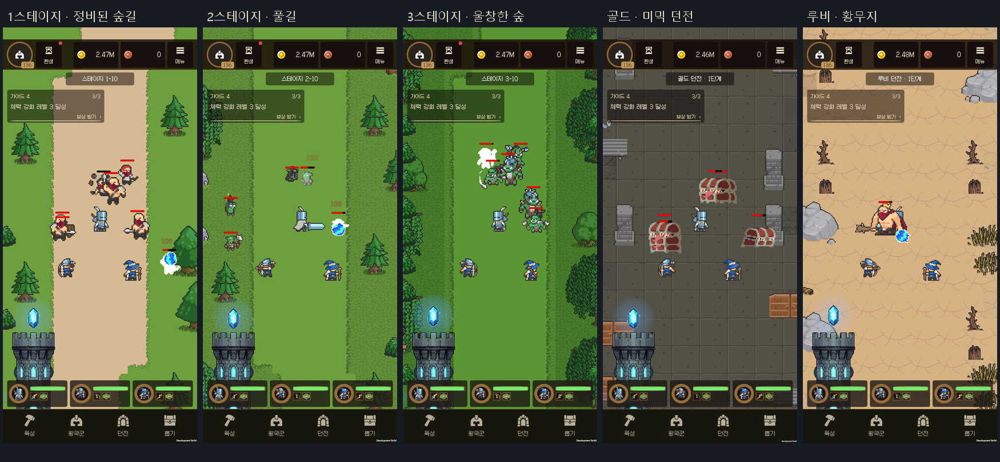

# 스테이지 통합 검증 — 2026-09-16

## 적용 결과

Stage_Catalog.xlsx → StageDataGenerator → Resources/StageDatabaseSO.asset → 전투·보상·배경 경로를 연결했습니다. 기존 Excel·SO의 meta GUID와 스테이지 ID, 계정 최초 보상 키를 보존했습니다.

- 14개 시트, 스테이지 43개, 실제 몬스터 구성 118개, 활성 몬스터 15종, 준비 로스터 41종, 환경 90개.
- Excel의 전체 전투 수치·시간·보상과 생성 SO 일치. 수식 오류 0개.
- 카탈로그 SHA-256: `f84d1f4e6532ede7409fab8ce94dd360fffced48d8f6eb546f6ad0b7b23ae3d6`.
- Unity에서 몬스터·환경 프리팹 153개/컴포넌트 1,361개 검사: 누락 스크립트·직렬화 참조 0개. 해당 프리팹·전투 씬·SO의 ExternalAssets 의존성 0개.

## 실제 Android 검증

Unity 6000.3.21f1, ARM64 IL2CPP 개발 빌드, Samsung SM-N986N / Android 13 / Adreno 650. 별도 `com.isolatedyouth.idlekingdomrpg.lobbyqa` 앱과 테스트 계정에서 진행했습니다. 원래 앱 데이터는 수정하지 않았습니다.

| 확인 | 결과 |
|---|---|
| 1–3스테이지 일반·보스 | 산적 → 고블린 → 오크, 해당 배경·보스 정상 생성 |
| 표시 크기·HP바 | 기존 크기 분류 유지. 무기·투명 여백 대신 실제 몸체 머리 좌표 적용. 산적 중심 피벗과 신규 발 피벗 차이 보정 |
| 3스테이지 | 짙은 바닥·촘촘한 수관과 하층 관목, 중앙 전투 공간 확보 |
| 골드 1단계 | HeresyMimic 20체, 20×450=9,000 골드, 입장권 1장 차감 |
| 골드 입장권 0장 | 진입 거절, 추가 차감 없음 |
| 루비 1단계 | 보스 3체 순차 생성. 최초 50+25=75 루비, 재클리어 50 루비 |
| 보관 제한 | 장비 300개·보관 80개에서 Stage3-10 배경 로드 후 ResultPending, 몬스터 0체, 입장권 유지. 검사 후 테스트 저장 복원 |
| 비율 | 기본 1080×2316, 좁은 폰 720×1600, 태블릿 비율 900×1200. 같은 실제 기기의 화면 크기 에뮬레이션이며 여러 실기기 검증은 아님 |

기기에서 발견한 화면 밖 보스 생성, 왕국군 대열의 가로 배율 0, 배경 로드 전 전투 시작, HP바의 시트 여백 간격을 수정했습니다. QA 터치 좌표도 Unity 렌더 표면과 Android 출력 크기의 차이를 반영하도록 고쳤습니다.

## 성능·빌드

3스테이지 실제 전투 15초/897프레임(FinalHud 빌드): 평균 **60.09 FPS**, 프레임 p95 **16.68 ms**, p99 **16.75 ms**, 33ms 초과 0회. Draw 평균 31.4/최대 34. Unity 사용 메모리 약 165.6 MB, 구간 증가 17.9 KB. GC 할당 약 1.42 KB/프레임으로 무할당은 아닙니다. 마탑 슬롯은 비워 배경·몬스터 비용을 측정했습니다. 로딩 시간과 저사양 기기 성능을 대표하지 않습니다.

최종 ReleaseCheck APK **108,737,932 bytes**, 빌드 1분 18초, 오류 0, 경고 12(스토어 아이콘 압축). 앞선 전체 컴파일에서는 기존 C# 경고 11개가 추가로 보고됐습니다. BuildReport의 1,372,515,604 bytes는 APK 파일 크기와 다른 값입니다.

Windows의 Gradle 템플릿 메모리 매핑 때문에 발생한 파일 쓰기 실패를 수정했습니다. Unity의 유휴 임포트 작업자를 정상 종료하고 캐시 핸들을 해제한 뒤 원자적으로 교체합니다. 동일 바이트는 다시 쓰지 않습니다. 원자적 교체만으로는 다른 임포트 작업자가 잡은 파일을 바꿀 수 없었던 재실패도 확인했습니다. Android resolver가 넣는 구식 `packagingOptions`를 현재 형식으로 정규화하며, 검증 빌드 후 임시 설정·생성 파일을 복원합니다.

## 증거·남은 범위

작업 기기의 `Recordings/CatalogIntegration/Stages/`에 원본 캡처·JSON·빌드 로그가 있습니다. `Final/Editor`의 catalog-validation.json과 reference-audit.txt, `FinalHud/Device`의 깨끗한 성능 측정·비율 캡처, `ReleaseCheck/Device`의 최종 왕관 간격 캡처를 사용합니다. 간추린 검증 데이터는 [Validation/StageIntegration](Validation/StageIntegration)에 버전 관리합니다. 이전 Final 측정 일부는 QA 결과 팝업이 남은 상태였으므로 최종 성능 근거에서 제외했습니다.

활성/예비 아틀라스 포함 정책, 마탑 10종·개화·뽑기 UI는 다음 작업 묶음입니다. 장기 성장 속도·신규 계정 완주 시간·실제 저사양/태블릿 기기는 아직 별도 검증이 필요합니다. 현재 고레벨 진단 계정의 전투 성공을 신규 계정 밸런스 통과로 간주하지 않습니다.
