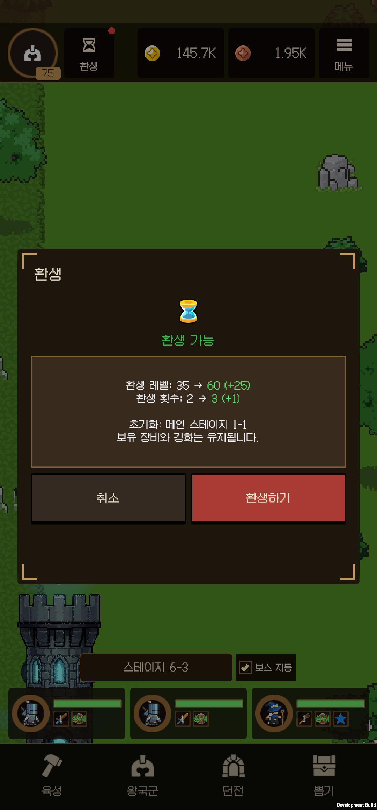
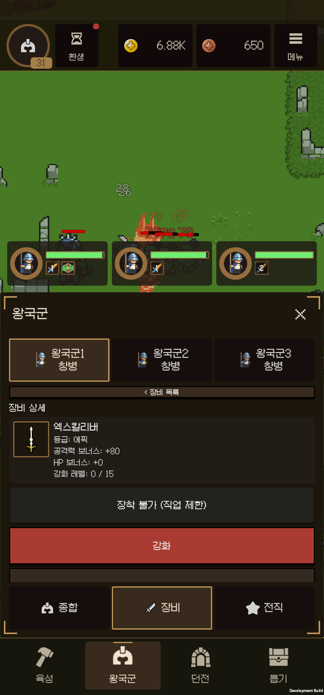

# Android 신규 플레이어 3회 환생 점검 보고서

2026-09-22 | 현재 브랜치 `ui-polishing` | 게임 0.14.1 | 실기기 SM-N986N / Android 13

## 1. 결과와 우선 판단

**신규 로컬 진행도에서 시작해 실제 Android 터치 플레이로 세 번째 환생까지 완료했다.** 매 회차 보스 클리어가 **3 → 4 → 5**, 환생 보상이 **+15 → +20 → +25**로 증가했다. 최종 환생 레벨은 **60**이다. 전투를 가속하거나 진행 중 재화·스테이지·승리를 주입하지 않았다.

다만 **완전히 새로운 서버 계정의 가입 여정은 검증하지 못했다.** 저장소를 비우고 정상 게스트 로그인을 했더니 기존 공용 개발 계정의 Lv.200 데이터가 들어왔다. 이를 먼저 기록한 뒤, 같은 빌드가 만든 초기 로컬 상태를 한 번 적용하여 Lv.1·1-1·재화 0·장비 0·스킬 0·창병 3명으로 시작했다. 아래 3회 환생 결과는 이 명시적인 초기화 조건의 결과다.

| 분류 | 우선순위 | 핵심 결과 |
| --- | --- | --- |
| 계정 구현 | P1 | 게스트 시작이 고정 공용 계정 로그인으로 연결된다. 순수 신규 가입과 계정 격리 확인이 불가능하다. |
| 기능 오류 | P2 | 예약 전직이 전투에 반영돼도 열린 왕국군 화면은 이전 직업과 장착 제한을 유지한다. 재열기로 해소된다. |
| 연동 미완료 | P2 | 신규 시작·환생 시 튜토리얼 자동 발생 연결이 없다. 현재 팀원 작업 중인 범위로 별도 표시했다. |
| 디자인 / 상태 일관성 | P2 | 환생마다 보스 자동이 꺼지고 1-10에서 멈춘다. 재로그인하면 저장된 켜짐 상태가 다시 적용된다. |
| 보상 디자인 | P2 | 궁수 전직을 사용할 수 없는데 새 보상으로 활을 획득한다. |
| 성장 정책 | P2 | 골드와 골드 강화까지 모두 보존되는 현재 환생 구조가 프로젝트의 초기화 방향과 다르다. 정책 확정이 필요하다. |

P1은 배포 전에 판단할 항목, P2는 정상 플레이의 혼란·진행 비용 또는 정책 불일치, P3는 사용성 개선 제안이다. 발견 사항은 수정하지 않았다. 퀘스트 가독성·스테이지 정보·튜토리얼 등 팀원 작업 파일도 변경하지 않았다.

## 2. 빌드·환경·시험 방법

| 항목 | 실제 수행 |
| --- | --- |
| 게임 코드 기준 | 시작 시 최신 HEAD `372e9f3c4`를 빌드. 과거 설치본의 플레이 결과를 사용하지 않았다. |
| Unity / Android | Unity 6000.3.21f1, IL2CPP ARM64, 연결된 SM-N986N 1대 |
| 실기기 해상도 | 기존 오버라이드 1080×2316, density 450 유지. 물리 해상도 1440×3088 |
| 관찰 빌드 | 0.14.1 / b59. 자동 계정 지정·신규 진행 강제 주입을 배제한 관찰용 빌드. 오류 0, 경고 90 |
| 최종 설치 빌드 | 0.14.1 / b60. 진단 프로브 제외. 오류 0, 경고 90. 실제 로그인·전투·왕국군 메뉴 확인 |
| 조작 | 화면의 버튼·라벨·좌표를 관찰하고 ADB 터치·드래그·뒤로가기로 조작 |
| 기록 | 화면 PNG, HUD/전투 상태 JSON, UTC 조작 기록, 로컬 저장 체크포인트, 앱 로그 |
| 진행 원칙 | 초기 상태 설정 1회 이후 정상 전투·퀘스트 보상·뽑기·전직·던전만 사용. 시계 변경·가속·재화 지급·강제 클리어 없음 |

진단용 APK의 실제 파일 크기는 99,436,050바이트다. Unity 빌드 요약의 약 1.89GB는 중간 산출물을 포함한 값이며 APK 크기로 해석하지 않았다. 90개 경고가 남아 있으므로 경고 없는 빌드라고 판정하지 않는다.

게스트 최초 접속에서 Lv.200, 골드 2,880,978, 고대 주화 18,220, 장비 300개, 공격/체력 강화 82/81을 관찰했다. 이 상태의 기존 자산을 신규 플레이에 사용하지 않았다. 초기화 원본과 적용 내역은 로컬 증거 폴더에 보관했으며 인증·계정 식별 정보는 보고서와 Git 산출물에서 제외했다.

## 3. 실제 3회 환생 기록

시각은 KST다. 환생은 버튼을 누른 순간이 아니라 **일반 웨이브 경계에서 저장에 반영된 시각**으로 판정했다.

| 회차 | 요청 시 도달 | 이번 회차 보스 클리어 | 보상 / 누적 환생 레벨 | 실제 완료 시각 | 회차 경과 |
| --- | --- | --- | --- | --- | --- |
| 1 | 4-5 | 보스 3 | +15 / 15 | 19:05:05 | 약 29분 27초 |
| 2 | 5-4 | 보스 4 | +20 / 35 | 19:16:12 | 11분 07초 |
| 3 | 6-4 | 보스 5 | +25 / 60 | 19:30:55 | 14분 43초 |

첫 신규 게스트 진입 조작은 18:35:37.939였고 세 번째 완료까지 **55분 17초**가 걸렸다. 초기 저장 적용 시각부터 계산하면 55분 57초다. 메뉴 확인·증거 수집·실패와 재도전을 포함한 시간이며 최적 공략 시간이나 평균 신규 사용자 소요 시간은 아니다. 관찰 샘플로 계산한 전면 전투 시간의 보수적 하한은 약 45분 34초다. 샘플 누락·긴 ADB 지연을 제외하므로 정확한 실플레이 시간으로 쓰지 않았다.

| 요청 직후 관측값 | 첫 환생 | 두 번째 환생 | 세 번째 환생 |
| --- | --- | --- | --- |
| 계정 레벨 | 43 | 60 | 75 |
| 공격 / 체력 강화 | 43 / 51 | 53 / 61 | 53 / 61 |
| 전투력 | 9,418 | 14,575 | 23,702 |
| 골드 | 26,829 | 44,689 | 146,879 |
| 고대 주화 / 마탑 지식 | 1,150 / 95 | 1,850 / 523 | 1,950 / 523 |
| 전직 파편 / 루비 | 83 / 0 | 123 / 9 | 43 / 126 |
| 보유 장비 | 33 | 50 | 13 |

첫 환생의 계정 레벨은 완료 직후 44였다. 세 번째 회차의 장비 수 감소는 일반 장비 52개를 직접 분해한 결과이며 유실이 아니다. 환생 3회 완료 뒤 같은 레벨·강화 상태에서 전투력 27,238을 관찰했다. 진행 중 장비·전직·스킬도 성장했으므로 회차 간 전투력 증가 전체를 환생 보너스로 해석하지 않았다.

### 회차별 실제 흐름

- **첫 회차:** Lv.1 / 전투력 600 / 창병 3명으로 시작했다. 1-9에서 전멸했고 메뉴 확인 중 1-8, 1-7로 후퇴했다. 공격 3·체력 11만으로는 충분하지 않았다. 공격 23·체력 21과 첫 무기 장착 뒤 보스 1을 넘겼다. 기사 2명·마법사 1명, 마탑 5슬롯, 골드 던전 1단계를 활용하고 보스 3 이후 환생했다.
- **두 번째 회차:** 1-10에서 보스 자동 꺼짐을 발견하고 다시 켰다. 루비 던전 1단계, 루비 골드 성장 2·경험치 성장 1, 퀘스트 보상, 마탑 뽑기를 사용했다. 총 50회 마탑 뽑기로 8종을 모두 소유했고 천벌을 개방했다. 보스 4를 넘어 +20을 받았다.
- **세 번째 회차:** 공격/체력 강화는 53/61을 유지했다. 마법사에게 에어 지팡이를 장착하고 정예 마법사로 전직했다. 골드·루비 던전 2단계, 분해·자동 분해·장비 강화, 수동 시전, 메테오 개화를 사용했다. 보스 5 클리어 후 6-4에서 요청해 +25를 받았다.
- **완료 후 보충 확인:** 네 번째 환생은 일일 3회 제한으로 차단됐다. 재로그인 시 3회/레벨 60과 성장·장비·스킬·입장권이 유지됐다. 1분 28초 오프라인 보상은 예상 13마리, 골드 +3,564, 경험치 +729였다. 이후 초기화·잠금 보호·튜토리얼 수동 미리보기 점검은 본 여정과 분리했다.

## 4. 재현된 구현 문제와 연동 공백

### F01. 게스트 시작이 공용 개발 계정으로 연결됨 - P1

**재현:** 앱 저장소 초기화 → 최신 b59 실행 → 계정 로그인 → 게스트로 시작. 기대는 독립적인 신규 계정 또는 명확히 구분된 로컬 게스트다. 실제로는 기존 Lv.200 데이터가 들어왔다.

**근거:** `TitleScreenController.cs:38`에서 `AuthenticateTest()`를 호출하고, `Authentication.cs:105-112`의 `LoginTest()`가 고정 Custom ID를 사용한다. b60도 같은 일반 로그인 경로다. 이 보고서는 계정 간 서버 쓰기 충돌이나 다른 사용자의 정보 노출까지 시험한 것은 아니다.

**영향 / 제안:** 신규 진입과 로컬 저장 경로의 계정 격리를 먼저 확정해야 한다. 사용자별 게스트 식별과 기존 계정 연결·복구 정책을 정리한 뒤 실제 신규 서버 계정으로 별도 재검증하는 것이 우선이다. 이번에는 인증 로직을 변경하지 않았다.

**증거:** `first-guest-login.png`, `first-guest-import-*`, `fresh-local-initialization.json`, `fresh-start-balance.json`.

### F02. 예약 전직 반영 뒤 왕국군 화면이 이전 직업을 유지함 - P2

**재현:** 창병을 선택하고 기사 전직 구매 → 안내대로 다음 일반 웨이브까지 기다림 → 왕국군 화면을 닫지 않은 상태로 엑스칼리버 상세 확인. 실제 전투 상태는 기사, 공격 192·체력 1,916인데 탭에는 창병이 남고 ‘장착 불가 (직업 제한)’가 계속 표시됐다. 3-2에서도 유지됐다. 화면을 닫고 다시 열자 기사로 갱신되고 장착이 가능했다.

**영향:** 전직 성공을 실패로 오해하거나 정상 장비를 장착하지 못한다. 예약 직업 적용 직후 열린 화면의 직업명·직업별 장비 판정·캐릭터 참조를 다시 갱신해야 한다.

**코드 확인:** `KingdomArmyPanelController.cs:1205`의 성공 콜백은 예약 시점에 탭과 상세를 다시 만든다. 실제 웨이브 경계의 직업 적용과 열린 장비 상세의 갱신 경로를 연결해 확인할 필요가 있다. 이것은 수정안이 아니라 관찰에 기반한 원인 후보다.

**증거:** `first-knight-change`, `job-boundary-stale-view`, `reopen-after-job-change`의 PNG·전투 JSON.

### F03. 튜토리얼 자동 발생 조건 미연결 - P2 / 팀원 진행 범위

초기 진입과 첫 환생에서 안내가 자동 재생되지 않았다. `GameDirectManager.cs:12`는 현재 단계가 명시적 요청만 받고 자동 조건을 연결하지 않는다고 설명한다. 미완료 연동을 플레이어 관점의 공백으로 기록하며, 제작 중인 튜토리얼 자체가 고장났다고 판정하지 않는다.

3회 환생을 마친 뒤 `first_start_menus`를 **수동 미리보기**로 요청해 4페이지 표시·다음·종료를 확인했다. `guide_mage_tower` 실습형 안내는 미리보기 실행을 의도적으로 거부했다(`GameDirectManager.cs:95`). 정상 실행 연결과 실습형 안내 전체의 저장·재개는 미검증이다. 해당 파일은 수정하지 않았다.

## 5. 게임 디자인·밸런스·사용성

### D01. 환생 직후 보스 자동 설정과 재로그인 상태가 다름 - P2

첫 번째와 두 번째 환생 전에는 보스 자동이 켜져 있었다. 환생 뒤 꺼져서 1-10에서 반복 전투했고, 체크박스를 다시 켜야 다음 장으로 진행했다. 세 번째 환생에서도 꺼졌다. 이후 재로그인하면 켜짐으로 복원됐다.

`StageManager.cs:492`는 환생 시 `SetBossAutoChallenge(false)`를 명시적으로 실행한다. 의도된 초기화라도 사용자의 반복 진행 기대와 충돌한다. 선택값 보존 또는 환생 완료 안내에서 재설정을 분명히 알려주는 방식이 필요하다. 현재 실행 상태와 저장된 설정의 관계도 통일할 필요가 있다.

### D02. 비활성 궁수의 장비가 신규 보상에 포함됨 - P2

궁수·정예 궁수 전직 칸은 ‘곧 추가 예정’이고 선택할 수 없다. 그런데 신규 로컬 플레이 중 기본 활·황금 활·황금 강철 활을 얻었고 실제 장착 대상이 없었다. 분해 재료로 쓸 수는 있지만 무기 보상을 얻은 순간의 성장 기대를 충족시키지 못한다.

기존 소유 장비는 보존하면서 새 보상 풀에서 해당 직업 장비를 제외할지 정책을 정하는 것이 좋다. 이번 1회 표본으로 활 획득 확률이나 전체 보상 손실률을 추정하지 않았다.

### D03. 환생이 골드 초기화보다 ‘기존 성장 보존 + 재주행’에 가까움 - P2 / 정책 확인

3회 모두 메인 스테이지만 1-1로 돌아가고 골드·공격/체력 강화·장비·전직·마탑이 유지됐다. UI도 장비와 강화 보존을 안내한다. 현재 구현 안에서 저장 누락이나 보상 오지급은 관찰하지 않았다.

다만 프로젝트 지침에는 골드·골드 강화 초기화와 더 큰 영구 보상의 구조가 명시되어 있다. 현재 구현은 이 방향과 다르다. 재화가 누적된 상태로 같은 초반 구간을 빠르게 다시 지나고 일일 3회 제한에 도달하는 구조이므로, 환생의 비용·보존 목록·영구 보상·재주행 단축 수단을 함께 확정해야 한다. 이번 시험을 근거로 임의로 초기화 정책을 바꾸지 않았다.

### D04. 초반 장벽과 장비 운의 영향 - P2 / 밸런스 관찰

첫 패배는 1-9였다. 성장 버튼·전직·장비·마탑을 찾아 사용해야 보스 1을 넘길 수 있었지만 자동 튜토리얼이 연결되지 않아 초반 선택의 안내가 부족했다. 첫 보스의 전직 파편 40개와 가이드 보상을 받은 뒤에는 진행이 빨라졌다.

에어 지팡이 +80 장착 한 번으로 같은 마법사의 실제 공격력이 **339 → 792**가 됐다. 장비가 강한 성장 동기를 주지만, 좋은 드롭 여부가 막힘 구간을 크게 바꿀 가능성도 있다. 확률을 조절하기 전에 장비 운이 다른 여러 신규 표본에서 보스 1 도달 시간·패배 수·드롭별 공격 기여를 비교하는 편이 타당하다.

### D05. 마탑 조작의 발견 가능성 - P3

자동/수동 전환은 마탑 몸체 길게 누르기로 작동했다. 떠 있는 수정 탭은 반응하지 않았고, 마탑 전체 영역의 하단은 왕국군 카드에 가려 다른 화면으로 연결될 수 있었다. 몸체의 노출된 부분은 정상 동작했다. 마탑 전체가 터치 불가한 오류는 아니다.

수동 기능을 모르고 지나갈 가능성이 있다. 첫 해금 시 길게 누르기 안내와 수동 상태 표시를 제공하고, 시각적으로 눈에 띄는 수정과 실제 입력 영역의 관계를 맞추는 것을 제안한다.

### D06. ‘온라인 전투 시간’의 메뉴 제외 규칙이 눈에 보이지 않음 - P3

전투가 뒤에서 계속되는 메뉴 점검 시간이 길었고, 시작 약 30분 뒤에도 일일 420초 목표는 414초로 표시됐다. `BattleEconomy.cs:174-180`은 메뉴가 `BlocksQuestBattleTime`을 세우면 누적하지 않는다. 타이머 산술 오류로 판정하지 않았다.

‘메뉴를 닫고 전투한 시간’이라는 의미를 안내하거나, 실제 백그라운드 전투 시간도 목표에 포함할지 결정해야 한다. 가독성 작업 중인 퀘스트 파일은 수정하지 않았다.

### D07. 개화 스킬 목록과 상세의 피해 비교 기준 - P3

천벌 목록은 ‘기준 피해 1.33K’, 상세는 ‘최종 1회 피해 13.36K’를 표시했다. 목록은 `GetEffectiveDamage`, 상세는 개화 효과를 반영한 `EffectivePower`를 사용한다. ‘기준’과 ‘최종’이라는 다른 정의이므로 피해 계산 오류라고 단정하지 않는다. 개화 상태의 비교 화면에는 최종 효과가 얼마나 강해졌는지 바로 비교할 수 있는 동일한 기준 또는 설명이 필요하다.

## 6. 기능별 확인 결과

‘확인’은 아래에 적힌 경로에서 동작을 관찰했다는 의미다. 모든 경계값·모든 조합이 정상임을 뜻하지 않는다.

| 기능 | 확인한 동작 / 결과 | 남은 범위 |
| --- | --- | --- |
| 신규 시작 / 로그인 | 최신 빌드에서 실제 게스트 진입. 공유 개발 계정 유입 재현. 초기 로컬 상태 적용 후 진행 | 독립 서버 신규 가입, Google 계정 로그인·연결 |
| 전투 / 스테이지 | 첫 전멸·이전 구간 복귀, 보스 1~5, 3장 이후 4~6장 증가, 자동 보스 전환 | 모든 후반 보스, 공격 모션·밀침·도발의 모든 프레임 조합 |
| 환생 | 보스 3/4/5로 3회 완료, 웨이브 경계 반영, +15/+20/+25, 쿨다운 안내, 던전 진입 중 차단, 3회 일일 제한 | KST 자정 경계, 레벨 300 상한, 요청 중 저장 실패 |
| 골드 성장 | 공격 53·체력 61까지 실제 재화로 성장, 수치·전투 반영 | 최대 레벨·대량 재화 극값 |
| 루비 성장 | 골드 2·경험치 1. 75루비 중 62소비 후 13. 경험치 초기화 +16, 재구매 -20 | 다음 날 초기화 한도 리셋, 고레벨 곡선 |
| 전직 | 기사 2명·마법사·정예 마법사 해금·예약 적용, 파편 차감, 잠긴 궁수 칸 | 신규 여정의 정예 기사 해금·재전직 전 조합 |
| 장비 | 획득·직업 제한·장착·해제 버튼 노출·등급 필터·상세·엑스칼리버 +1 (+80→+88) | 실제 해제 실행, 정렬·직업 필터 조합, 강화 실패 확률·최대치 |
| 분해 | 일반 52개→강화석 52. 일반 자동 분해 후 강화석 증가. 완료 후 잠금 장비 1개+장착 3개가 일괄 분해에서 모두 보존 | 300칸 포화·추가 보관·대규모 묶음 경계 |
| 가방 | 전체·장비·재료·기타 탭, 분해 확인창과 소유 표시 | 없는 종류의 소비 아이템 사용 |
| 뽑기 | 장비 1회, 마탑 총 50회. 부족한 주화로 재뽑기 시 차감 없이 실패 안내 | 천장 경계·통계적 균등 확률 검증 |
| 마탑 로스터 | 0/1/2/3/4/5/7/9 8종 획득·장착·발동. 제거 ID 6/8 노출 없음 | 모든 5슬롯 조합과 중첩 최악 조건 |
| 강화 / 각성 / 개화 | 천벌 강화3·각성10, 메테오 각성10. 이름·아이콘·개화 상태 갱신. 완료 후 강화 초기화 지식25 반환, 각성10 유지 | 나머지 6종 개화, 모든 전환 타이밍 |
| 수동 시전 | 마탑 길게 누르기 ON/OFF, 탭 시전, 공허·암석·메테오 드래그. 기본 얼음/유성우 드래그는 쿨다운 미소비 | 화면 가장자리·다중 터치·모든 조준 위치 |
| VFX / 효과 | 8종 시작/종료, 피해·회복 로그. 메테오 착탄·장판 종료, 성역 회복, 쿨다운 숫자 표시 | 모든 프레임의 시각 품질, 장시간 대량 중첩, 스프라이트 임포트 전체 재감사 |
| 던전 | 골드1/2: +9,000/+14,400. 루비1/2: +75/+117. 각 입장권2회 사용, 잠금·잔여0·종료 카운트다운·자동 복귀 | 3단계 이후, 시간 초과·중도 퇴장·다음 날 충전 |
| 장비 던전 | ‘준비 중’ 표시와 비활성 확인 | 콘텐츠 자체 미구현 / 진입 불가 |
| 퀘스트 | 가이드·일일·주간·업적 탭, 완료 보상·이동 경로·후속 목표 | 자정·주간 경계, 모든 후반 업적 |
| 설정 | K/M/B·한국식·지수 표기, 음소거 토글, 흔들림 OFF, 저사양·절전·화면 켜짐 유지 토글 | 실제 청취 품질, 저사양 단독 효과, 모든 접근성 조건 |
| 저장 / 복귀 | 강제 종료 후 실제 로그인, 성장·직업·장비·스킬·던전 티켓 유지, 1분28초 오프라인 보상 | 저장 중 전원 차단·손상 파일·8시간 이상 신규 여정 |
| 튜토리얼 | 자동 연결 공백 확인, 완료 후 기본 메뉴 4페이지 수동 미리보기 | 실습형 전체 정상 실행·저장·복귀 |

마탑 발동 기록에는 8종 모두 `begin/end`, 피해 스킬의 `damage`, 성역의 `heal`이 존재했다. 이 기록만으로 공격·회복의 모든 계수와 픽셀 단위 VFX 정확성을 입증하지는 않는다.

## 7. 성능·안정성 관측

같은 SM-N986N에서 실제 전투를 각각 30초 측정했다. 두 구간의 스테이지·적 수가 달랐고 저사양과 절전을 함께 켰으므로 저사양 단독 효율의 대조 실험은 아니다.

| 항목 | 일반 설정 | 저사양 + 절전 |
| --- | --- | --- |
| 목표 / 관측 FPS | 60 / 59.68 | 30 / 29.93 |
| 평균 프레임 / p95 | 16.76 / 16.68ms | 33.41 / 33.32ms |
| 최장 프레임 | 91.51ms | 74.90ms |
| 50ms 초과 프레임 | 3 / 1,786 | 3 / 893 |
| 프로세스 CPU 시간 / 30초 | 26.05초 | 17.00초 |
| 평균 드로콜 | 32.51 | 35.93 |
| Unity 추적 메모리 종료값 | 약 194.20MB | 약 194.34MB |

절전 시 목표 30fps가 적용되고 진행·터치·메뉴 조작이 유지됐다. CPU 시간 감소는 관측값으로만 제시한다. 측정 빌드는 Development IL2CPP이고 진단 상태 수집이 포함되어 있다. GC 할당에는 진단 JSON 생성 등이 섞일 수 있어 이를 출시 빌드의 누수·게임 로직 할당 문제로 단정하지 않았다. 추적 메모리는 Android 전체 PSS나 그래픽 메모리의 완전한 합계가 아니다.

수집한 앱 로그에서 FATAL EXCEPTION·NullReferenceException·IndexOutOfRangeException·OutOfMemory 패턴은 발견하지 못했고, 관찰 중 앱 크래시는 없었다. 로그는 무중단 전 구간 보증이 아니다. 수동 재시작 뒤와 최종 b60의 로그 수집 구간을 구별한다. PC에서 두 번째 빌드를 수행하던 중 일부 ADB 응답 지연은 게임 프레임 정지로 판정하지 않았다.

## 8. 오탐 제외와 시험 한계

- **화면 밖 버튼 오탐 제외:** 진단 HUD 목록은 마스크 밖·모달 뒤의 컨트롤도 포함한다. 초기 스킬 초기화·장비 잠금 시도 중 화면 밖 좌표를 누른 실패는 게임 버그에서 제외했다. 실제 보이는 곳까지 스크롤한 뒤 둘 다 정상 동작을 다시 확인했다. 잠금으로 목록이 강제 초기화된다는 초기 의심도 철회했다.
- **환생 완료 판정:** ‘환생합니다’ 토스트와 요청 직후 파일은 완료 증거가 아니다. 각 회차의 `ReincarnationCount`, `ReincarnationLevel`, `LastReincarnationUtc`가 실제 변경된 저장 파일을 확인했다.
- **한 표본의 한계:** 신규 로컬 플레이 1회, 실기기 1대다. 승률·장비/스킬 확률·적정 세션 길이·결제 전환·D1 유지율을 통계적으로 판단할 수 없다.
- **비율 / 기기 범위:** 이번에는 기존 1080×2316 설정 한 가지로 진행했다. 좁은 폰·태블릿·다른 GPU·다중 실제 기기 검증은 하지 않았다.
- **접근 불가 범위:** 일일 티켓·재화·확률로 도달하지 못한 후반 콘텐츠, 실제 결제·광고·Google 로그인, 저장 손상·네트워크 장애·자정 롤오버는 완료 판정에서 제외했다. 테스트를 위해 티켓·레벨·희귀 아이템을 지급하지 않았다.
- **별도 점검 필요:** 공격 모션·보스 이동·도발 우선권·보호막·모든 개화의 시각 정확성은 이번 일반 플레이 관찰만으로 전부 검증했다고 할 수 없다. 스프라이트 최적화 상태의 전면 감사도 이번 보고서의 완료 범위에 포함하지 않는다.

## 9. 조치 우선순위와 인계 상태

1. **계정 분리와 신규 진입 경로 확정:** 공용 게스트 경로를 배포 경로와 구분하고, 진짜 신규 서버 계정으로 시작 조건을 다시 검증한다.
2. **열린 왕국군 UI 갱신 오류 수정:** 예약 전직 적용 이벤트에 직업·장비 판정·캐릭터 참조 갱신을 연결한다. 동일 화면 유지→다음 웨이브→장비 장착의 재현 절차로 재검증한다.
3. **팀원 작업과 연동 일정 조율:** 튜토리얼 자동 발생 조건을 연결할 시점과 초반 성장·수동 마탑 설명을 합의한다. 퀘스트 시간 의미도 함께 조율한다.
4. **환생/보상 정책 결정:** 보스 자동 보존, 골드 초기화 여부, 보존 항목 안내, 비활성 직업 장비의 신규 획득 정책을 먼저 정한다.
5. **후속 밸런스 표본 수집:** 다른 장비 운의 신규 플레이를 반복하고, 보스 1 도달·실패·재주행 시간을 비교한다. 이번 수치만으로 전투 계수나 보상량을 바꾸지 않는다.

이번 변경은 관찰용 빌드 진입점·QA 조작/기록 도구·Android 빌드 번호·보고서다. 실제 게임 로직·시각 에셋·팀원 작업 영역은 변경하지 않았다. 빌드가 만든 URP/Resolver 등 부수 변경은 되돌렸다.

기기에는 프로젝트 앱 **한 개, 0.14.1 / b60**가 설치되어 있다. 원래 저장 자료는 복구 직후 **63개 파일의 SHA-256 일치**를 확인했다. 이후 정상 로그인과 오프라인 보상·짧은 전투로 생긴 정상 진행 변화는 존재한다. 최종 빌드는 진단 계정 강제 지정을 포함하지 않는다. 실제 로그인·전투·왕국군 메뉴 확인 후 앱을 종료하여 추가 진행을 멈췄다. 다른 앱과 개인 파일은 건드리지 않았다.

3회 환생 신규 플레이 저장은 원본 복구와 별개로 PC에 보관했다. 기기의 이번 진단 데이터는 제거했고 원래 해상도·밀도를 유지했다. 원본 APK와 테스트 APK는 재현·복구용 PC 증거로 보존했다.

## 10. 증거 위치와 추적 방법

실행 증거 기준 경로: `Recordings/NewPlayer20260922/` (Git 제외, 계정 데이터 포함 가능).

| 위치 | 내용 |
| --- | --- |
| `Original/` | 실행 전 private/external 저장·기존 APK·해시 manifest |
| `Build/`, `ManualBuild/` | b59/b60 APK, 빌드 결과·경고 기록·manifest |
| `Run/actions.jsonl` | 실제 터치·요청의 UTC 기록 |
| `Run/*-hud.json`, `*-balance.json`, `*.png` | 같은 태그로 묶인 화면·전투 상태·캡처 |
| `Run/reincarnation-1/2/3-boundary-check-*` | 각 환생 완료를 확인한 실제 저장 체크포인트 |
| `Run/Timing/` | 보수적 활성 시간 샘플과 계산 방식 |
| `CompletedJourney/` | 3회 환생 후, 보충 검증 전 저장 전체와 해시 |
| `RestoredManual/` | 원본 복구 검증, b60 버전, 로그인·전투·메뉴 캡처 |
| `Docs/QA/NewPlayer20260922/` | 보고서용 비식별 핵심 캡처·요약 JSON |

주요 코드 근거 (행 번호는 이번 검토 기준):

- 게스트 버튼: `Assets/UGUI/Scripts/Views/TitleScreenController.cs:38`
- 계정 로그인: `Assets/_Project/Scripts/Server/Auth/Authentication.cs:105`
- 전직 화면 갱신: `Assets/UGUI/Scripts/Views/KingdomArmyPanelController.cs:1205`
- 튜토리얼 연동: `Assets/_Project/Scripts/Direction/GameDirectManager.cs:12`
- 환생 뒤 자동 도전: `Assets/_Project/Scripts/Core/Manager/StageManager.cs:492`
- 환생 조건·보상: `Assets/_Project/Scripts/Reincarnation/ReincarnationService.cs:14`
- 퀘스트 시간: `Assets/_Project/Scripts/Core/Balance/BattleEconomy.cs:174`
- 마탑 길게 누르기: `Assets/UGUI/Scripts/Hud/MageTowerEnvController.cs:352`
- 목록 피해 표시: `Assets/UGUI/Scripts/Views/MageTowerPopupController.cs:154`
